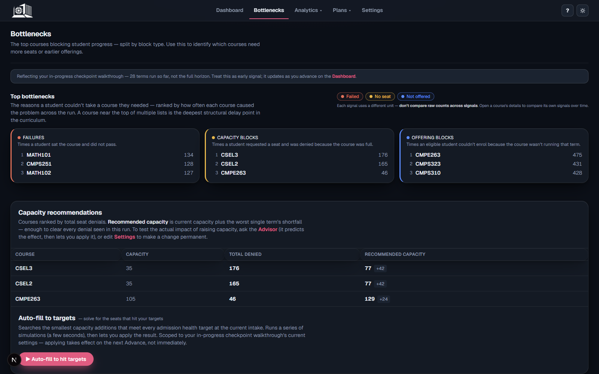
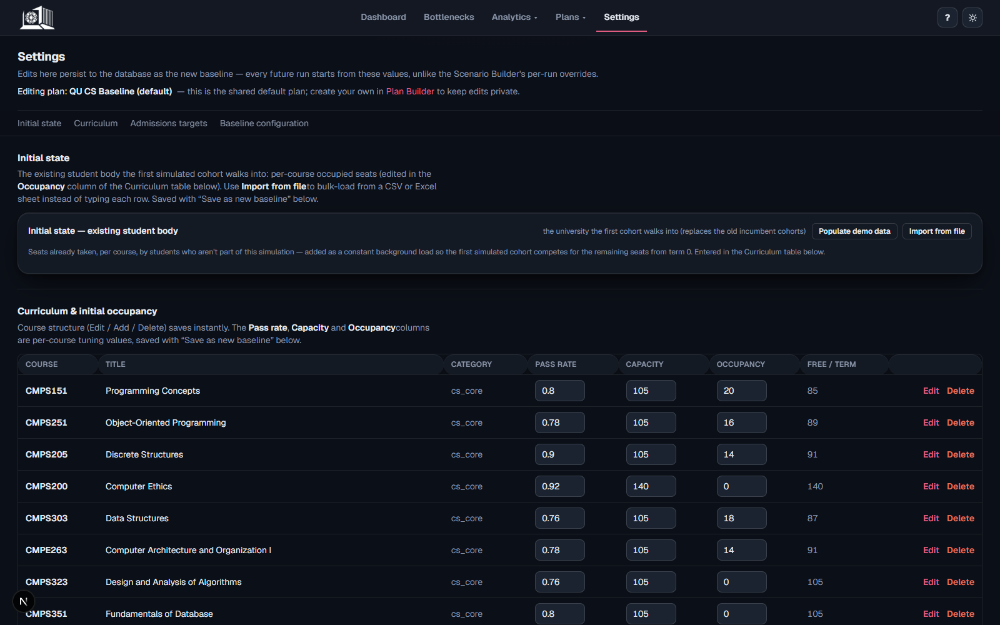
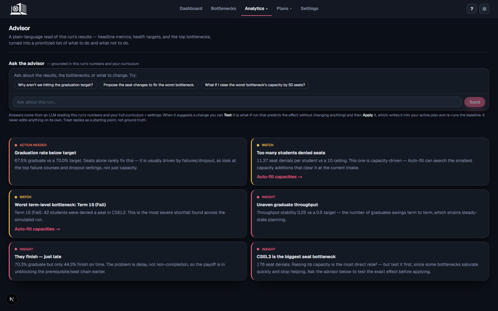
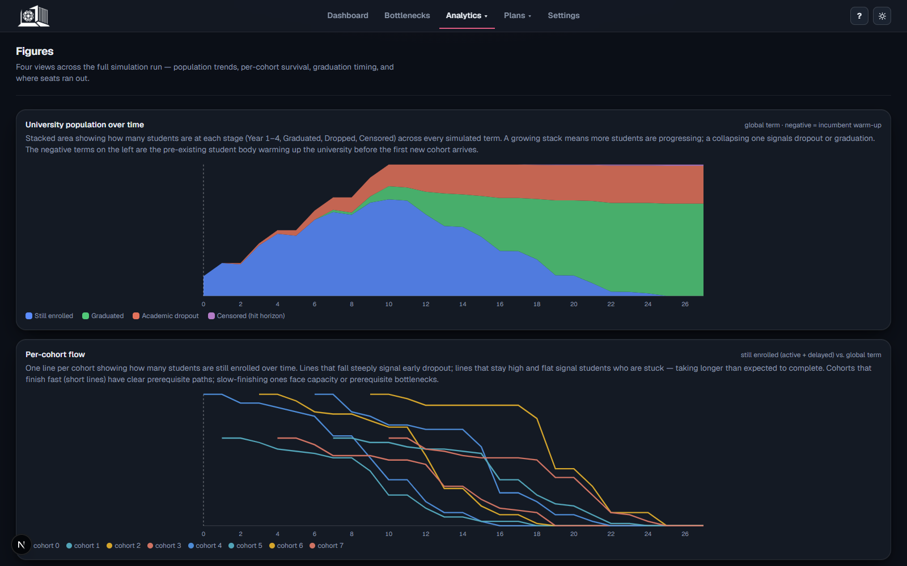
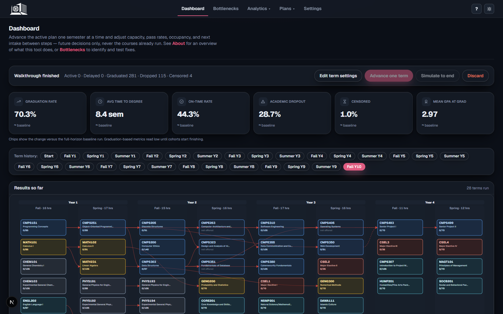

# Qatar University

**College of Engineering**  
**Department of Computer Science and Engineering**

# Internship Report

## At Scale AI

### Cohort Flow Simulator

**Student Name:** Najeeb Abdi  
**Student ID:** [Insert student ID]  
**Mentor / Supervisor (Scale AI):** [Insert supervisor name]  
**Internship Period:** [Insert internship period, 7 weeks]  
**Host Organization:** Scale AI (remote host, completed on Qatar University's campus)  
**Academic Institution:** Qatar University, College of Engineering, Department of Computer Science and Engineering  
**Year:** 2026  
**Repository:** [github.com/najeeb101/Single-Cohort-Flow-Simulator](https://github.com/najeeb101/Single-Cohort-Flow-Simulator)

This project report is submitted to the Department of Computer Science and Engineering of Qatar University in partial fulfillment of the requirements of the Practical Training course, completed under the Scale x Qatar University Practical Training program.

College of Engineering  
Department of Computer Science and Engineering

\newpage

## Abstract

During my internship, completed on Qatar University's campus with Scale AI as the remote host organization, I worked on the design and development of the Single-Cohort Flow Simulator, a software system built to study student progression through Qatar University's Computer Science curriculum. The project focuses on an academic planning problem: when students are delayed, it is often difficult to determine whether the delay was caused by course difficulty, missing prerequisites, limited seats, or courses being offered only in certain terms.

To address this problem, I developed a discrete-term, agent-based simulation model that represents students as individual agents moving through the curriculum over time. The system models prerequisites, course offerings, pass and fail outcomes, seat capacity, academic probation, dropout, and graduation. It has since grown from its original single-cohort design into a multi-cohort, steady-state model in which several overlapping cohorts are admitted year after year and compete for one shared pool of course seats, which is closer to how a real department actually operates. I also contributed to the FastAPI backend, SQLite persistence layer, and Next.js dashboard that make the simulator usable as an interactive decision-support tool.

The final result is a working platform that can run curriculum simulations, identify bottlenecks through separate failure, capacity, offering, and prerequisite signals, support what-if analysis through a scenario tester and a bounded capacity-planning solver, and present the results visually through a web dashboard. On the current baseline configuration, the simulator reports a steady-state graduation rate of about 66% within a 12-semester horizon, with mathematics gateway courses driving most failures and major-elective seats driving most capacity pressure; these findings are discussed in Section 5. This internship strengthened my skills in simulation modeling, backend development, database design, frontend implementation, testing, and technical documentation.

## Acknowledgment

I would like to express my sincere gratitude to my mentors and colleagues at Scale AI for their guidance and support throughout this internship, and to my instructors at Qatar University for their feedback on both the technical quality of the project and the way I explained its purpose.

I would also like to thank the Department of Computer Science and Engineering at Qatar University for providing the academic foundation, and the campus environment, that allowed me to work on a project combining software engineering, data analysis, and educational planning. This internship gave me the opportunity to apply concepts from my coursework to a practical system with real academic relevance, while working with a remote host organization.

\newpage

## Table of Contents

1. Background of the Organization and Project
2. Internship Learning Objectives
3. Methodology and System Design
4. Internship Experience
5. Results and Findings
6. Challenges Faced
7. Reflections and Learning Outcomes
8. Recommendations and Future Work
9. Conclusion
10. References
11. Appendix

\newpage

## 1. Background of the Organization and Project

### 1.1 The Host Organization: Scale AI

This internship was completed on Qatar University's campus, with Scale AI as the remote host organization, through the **Scale x Qatar University Practical Training program**, a joint arrangement in which Scale AI, a technology company that builds data-labeling, evaluation, and human-feedback infrastructure used by AI research labs and enterprises to train and evaluate machine learning models, hosts QU students on independent, self-directed technical projects. Students are assigned a task from a shared Practical Training Task Catalog: each task is scoped for one student to complete solo, end-to-end, in roughly 25-30 hours of work per week across the seven-week training window, and is graded against a common rubric worth 15% of the practical training grade, scored across five bands from Excellent to Failing. This is how this simulator came to be the deliverable: rather than working on Scale AI's own data pipelines, I built a data-driven decision-support tool for a curriculum-planning problem I had first-hand context on as a Qatar University Computer Science student. The engineering habits the internship emphasized, treating a system as something to be measured and evaluated with structured evidence rather than a single headline number, carried directly into how this project's own bottleneck analytics were designed (Section 3.4).

### 1.2 The Academic Project: Qatar University's Computer Science Curriculum

Qatar University is the national university of Qatar and offers a Bachelor of Science program in Computer Science through the College of Engineering. The Computer Science curriculum includes a structured sequence of programming, mathematics, computer systems, software engineering, databases, networks, cybersecurity, electives, and senior project courses. Like many technical programs, this curriculum depends heavily on prerequisite chains and term-based course offerings.

The project developed during this internship, the Single-Cohort Flow Simulator, was designed to support academic planning for this kind of curriculum. Its name reflects the project's origin as a model of a single incoming class; it has since grown into a multi-cohort, steady-state model of the whole department, and the name was kept for continuity rather than renamed mid-project. The main idea behind the project is that student delay cannot be understood only by looking at final graduation numbers. A student may be delayed because a difficult course was failed, because an important course was full, because a prerequisite was not completed, or because a required course was not offered in the needed term. These causes look similar in a transcript, but they require different solutions.

The simulator therefore models student progression term by term. It uses the 2024 Qatar University Computer Science study plan as its curriculum structure, including 41 courses and 120 credit hours. Students are simulated as individual agents who attempt to register for courses, compete for limited seats, pass or fail courses, and move toward graduation. Rather than modeling one class in isolation, the engine now admits a new cohort every year and keeps several cohorts enrolled at once, all drawing from the same pool of course seats, so that a shortage in one gateway course is felt by freshmen and seniors alike. The system records the reason each student becomes blocked, allowing the project to identify curriculum bottlenecks in a more explainable way.

The final application includes a Python simulation engine, a FastAPI backend, a SQLite database layer, and a Next.js dashboard. These components work together to provide an interactive tool for running simulations, reviewing bottlenecks, testing policy changes, and viewing academic flow through charts and dashboard pages.

## 2. Internship Learning Objectives

### 2.1 Activity Objectives

At the beginning of the internship, the main activity objectives were:

- Understand the structure of the Qatar University Computer Science curriculum and identify the factors that can delay student progression.
- Build a simulation model that represents students, courses, prerequisites, terms, pass rates, and seat capacity.
- Develop backend services that expose simulation results through a clean API.
- Create a database model that stores plans, courses, configuration, scenarios, and run history.
- Build a web dashboard that presents simulation results in a clear and interactive way.
- Add analytics that separate different bottleneck causes instead of combining them into one score.
- Document the system so that future users and developers can understand the design decisions.

### 2.2 Growth Objectives

The personal growth objectives of the internship were:

- Improve my ability to work independently on a long-running software project, including while working with a remote host organization rather than on-site.
- Strengthen my understanding of backend architecture, API design, and database modeling.
- Gain more experience with React and TypeScript through a practical dashboard interface.
- Learn how to translate a real academic planning problem into a software model.
- Improve my debugging and testing skills, especially for deterministic simulation behavior.
- Become better at explaining technical work to both technical and non-technical audiences.

### 2.3 Significance of the Objectives

These objectives were important because they connected directly to my academic studies and future career goals. The project required knowledge from data structures, algorithms, database systems, software engineering, probability, and statistics. It also required practical decision-making, because the system had to be useful, understandable, and maintainable rather than only technically complex.

The internship helped me move from classroom-based understanding to applied development. Instead of building a small isolated assignment, I worked on a system with multiple layers, many design decisions, and a clear user purpose.

### 2.4 Connection to the Organizations' Missions

The project connects to two missions at once. It connects to Qatar University's mission by supporting academic quality, data-informed planning, and student success: by making curriculum bottlenecks visible, the simulator can help academic planners discuss possible improvements to course capacity, prerequisite structure, offering patterns, and admission size. It also reflects the engineering discipline emphasized at Scale AI, where rigorous, structured evaluation of a complex system is the core of the business: this project applies that same instinct to a university curriculum, replacing a single graduation-rate number with four separately tracked bottleneck signals so that a claim about "why students are delayed" is backed by specific, checkable evidence rather than intuition. The system does not replace academic judgment, but it provides structured evidence that can support better decisions.

## 3. Methodology and System Design

### 3.1 Overall Approach

The project followed a research-driven software engineering approach. The first step was to define a clear problem: how to explain student delay in terms of curriculum structure rather than only final outcomes. Once the problem was understood, it was translated into a model where each student progresses through the curriculum over time according to a consistent set of academic rules and institutional constraints.

### 3.2 Simulation Model

The simulator uses a discrete-term loop with three phases repeated every academic term. In the first phase, each active student builds a priority-ordered list of desired courses: any failed course they must retake comes first, followed by courses grouped into configurable priority tiers (core and college-requirement courses first, electives only once a student has earned enough credit hours, then remaining math, science, English, and general-education requirements), subject to a course-load cap that is reduced further for students on academic probation. In the second phase, every student who requested a given course is ranked by class standing and a random tiebreak, and seats are granted in that order until the course's capacity is exhausted; everyone else is recorded as capacity-blocked. In the third phase, each granted enrollment resolves to a pass or fail outcome, and the student's GPA, completed credit hours, probation status, and graduation status are updated accordingly. Because seat allocation is ranked by class standing across the whole shared pool, senior students from older cohorts outrank incoming freshmen automatically, without any special-case code.

Students are not treated as a single average cohort; instead, they retain individual histories, completed credits, GPA, probation status, and progression patterns. A separate personal counter tracks how many mandatory (Fall/Spring) semesters a student has personally used, distinct from the university's overall calendar term; this distinction matters because the curriculum also includes optional Summer/Winter terms in which a student can take a service course without spending one of their limited semesters. This makes the model more realistic because students often follow different paths even when they belong to the same department or program, and it prevents the optional terms from silently distorting how long a student is judged to have taken.

### 3.3 Architectural Design

The implementation was organized using a layered architecture. The simulation engine is implemented in the core Python module, while the service layer exposes the engine through a structured interface with no file I/O of its own. The API layer provides HTTP access, the database layer handles persistence, and the frontend dashboard presents the results in a visual and interactive format. This separation of concerns was important because it allowed the project to grow from a script-based prototype into a more complete academic planning tool without mixing the responsibilities of the different layers, and it is what let the same simulation engine be reused unchanged by a command-line script, an HTTP API, and a resumable, term-by-term checkpoint session (Section 4.6).

### 3.4 Analytics and Decision Support

The project also includes an analytics layer that transforms raw simulation output into useful planning information. Instead of reporting only final graduation rates, the system records four separate bottleneck signals every term: a *failure* count when a student attempts and fails a course, a *capacity* count when an eligible student requests a seat but loses the allocation, an *offering* count when an eligible student's course simply is not taught that term, and a *prerequisite* count when a student is still waiting on an upstream course. These four signals are never merged into a single score, which is what makes it possible to say whether a given course is a problem because it is hard, because it is oversubscribed, because it is scheduled too rarely, or because it is downstream of a different, harder gateway.

Course capacity itself is not sized uniformly: because a missed seat in an early, once-a-year gateway course can push a student off the normal annual rhythm and into a full year's delay, the required core sequence and all non-elective service courses are sized to peak historical demand, while the interchangeable major electives are deliberately squeezed to a lower percentile so that some contention remains where it does the least harm. This sizing policy, together with the block signals above, is what the results in Section 5 are read against.

### 3.5 Why This Method Was Appropriate

This methodology was appropriate because it balanced realism, explainability, and flexibility. The model captures the logic of academic progression while remaining understandable to users who might not be familiar with software implementation. It is also flexible enough to support scenario comparison, policy testing, and future changes to the curriculum or admissions pattern. In this sense, the simulator is not only a technical artifact; it is also a decision-support tool for educational planning.

To strengthen the technical evaluation of the system, the implementation was reviewed through both validation and output evidence. The project includes automated tests for determinism, prerequisite logic, graduation behavior, capacity allocation, API behavior, and database behavior. It also produces structured outputs such as `outputs/reports/simulation_summary.csv`, `outputs/reports/flow_timeline.json`, and the figures stored in `outputs/figures/`, which demonstrate how the simulation results can be inspected and compared in practice, and which are the source of the results reported in Section 5.

## 4. Internship Experience

The internship ran for seven weeks. The assigned catalog task was to design and build, independently and end-to-end, a data-driven decision-support system for a real institutional planning problem; I chose Qatar University's own Computer Science curriculum as that problem, given my direct exposure to it as a QU CS student. The first two weeks built the core engine and turned it into a full-stack application; the middle weeks alternated between adding a feature, testing it against the research question, and cutting or rebuilding whatever did not hold up; the final weeks focused on the platform's decision-support tools and on tightening the whole system before submission.

### 4.1 Week 1: Understanding the Domain and Building the Core Engine

The first week focused on understanding the curriculum and designing the core simulation approach. I reviewed the Computer Science study plan, prerequisite structure, and the main assumptions needed to represent student movement through the program.

I then built the core Python simulation engine. The engine uses a discrete-term loop where each student attempts to register for courses, receives seats based on capacity and priority, and then either passes or fails enrolled courses. Each student has their own academic state, including completed courses, credit hours, GPA, probation status, and graduation status. Within the same week, I extended this from a single-class model into a multi-cohort one by adding a GPA-driven dropout rule and a shared capacity bottleneck across course sections, which set the direction for the rest of the project.

One important design decision was to model students individually instead of using only aggregate cohort totals. This was necessary because prerequisite eligibility depends on each student's personal course history. A student who failed a gateway course may be blocked from several later courses even if the rest of the cohort is progressing normally.

### 4.2 Week 2: From Script to Full-Stack Application

The second week moved the project from a script-based simulation into a full-stack application. I first ported the static output figures and the prerequisite-network diagram into an animated, interactive Next.js and React dashboard, replacing a set of one-off image files with pages a user could actually click through. I then built out the backend: a FastAPI layer that ran the simulation through HTTP endpoints, and a SQLAlchemy/SQLite persistence model so that courses, plans, configurations, scenarios, and runs could be represented in a structured way, alongside a first multi-page dashboard and a Scenario Builder.

I also began work on the multi-plan model, so that more than one curriculum-and-configuration combination could be stored, imported, and compared without one overwriting another, together with a Plan Builder wizard for creating a new plan from scratch or by cloning the default one, plus a first visual design pass on the dashboard.

### 4.3 Week 3: A First Live Simulation Mode, and Learning to Cut Scope

In the third week, I built the first version of a stepwise, term-by-term simulation mode, an early "Live Simulation" feature, so a user could watch the model advance one term at a time instead of only seeing a finished run. I also added a Bottlenecks page with capacity-section recommendations, ranking courses by which one would benefit most from additional seats.

Figure 1 presents the bottlenecks analysis page, where the system ranks the main causes of delay, failure, capacity pressure, and offering limitations, separately, and suggests a capacity target for each flagged course.

Later in the same week, I made a deliberate simplification pass: I removed authentication, the Scenario Builder, a separate Capacity Planning page, and an instructor concept that had accumulated but were not central to the research question, in favor of a single shared demo user and a leaner what-if panel merged directly into Bottlenecks. This was the first of several points in the internship where building a feature and then honestly re-evaluating whether it served the project's actual question turned out to be more valuable than keeping everything I had built (see also Section 6.3).

### 4.4 Week 4: Initial-State Modeling and the First Decision-Support Tools

The fourth week introduced the Initial-State model, which replaced an earlier simulated-incumbents warm start. Instead of simulating a second, fictitious population of already-enrolled students, the university's actual current occupancy is entered directly: a required first-run setup gate asks for how many seats in each course are already taken by the existing student body, with a CSV bulk-import option for entering many courses at once.

Figure 2 shows the settings page, where curriculum and configuration values, including this initial occupancy, can be adjusted. It highlights the flexibility of the platform and shows that the simulation can be adapted to different planning scenarios and institutional policies.

I also built the first version of two decision-support features on top of a completed run: a rules-based Advisor panel that reads a run's health criteria and top bottlenecks into a prioritized, plain-language list of recommendations, and a bounded Auto-fill solver that searches for the smallest capacity increases needed to meet an admissions target. The Advisor was given its own dedicated page in the dashboard for the first time this week.

Figure 3 illustrates the advisor page in its current form. At this stage in the internship it held only the rules-based recommendations described above; the grounded chat interface and testable proposals shown here were added the following week.

### 4.5 Week 5: Realistic Scheduling, an LLM-Grounded Advisor, and Performance

This was the busiest week of the internship. I reworked the course-offering schedule to match Qatar University's real pattern instead of a blanket Fall-and-Spring assumption: several core courses run in only one term a year, and non-CS service courses additionally run in an optional Summer term. Alongside that, I switched admissions from a simulated incumbent population to the steady-state model described in Section 1.2, with several overlapping cohorts admitted every year into one shared pool of seats.

Figure 4 shows the analytics view, where university enrollment trends and per-cohort flow patterns are displayed. These charts only became a meaningful signal once the offering schedule and admissions model behind them were realistic; before that, they mostly showed an artifact of the simplified assumptions rather than a pattern worth planning around.

I also upgraded the Advisor from the rules-based panel built in Week 4 into an optional LLM-backed chat, grounded in the run's numbers and the full active curriculum, that can answer detailed course-level questions and, when it recommends a concrete change, propose it as a card the user can first test in a sandboxed simulation and only then apply; the model itself never writes to the plan directly. Alongside these modeling changes, I did a round of performance work, parallelizing the Monte Carlo and Auto-fill workloads across processes and caching a monotonic eligibility check, and a long pass of dashboard layout and accessibility polish.

### 4.6 Week 6: Replacing Live Simulation with a Resumable Semester Checkpoint Mode

By the sixth week, it was clear that the Live Simulation feature from Week 3 did not match how an academic planner actually works: its continuous-tick, replay-log design let a user watch a run happen, but not cleanly pause, edit a future setting such as next year's intake or a course's capacity, and continue from exactly that point. I removed it, from both the frontend and the backend, and replaced it with Semester Checkpoint Mode.

Building the replacement meant first making the simulator itself resumable: a new method advances the engine by exactly one calendar term, and the engine can snapshot and later restore its full internal state, so a session can pause after one request and resume in a brand-new process on the next. I exposed that as a session-based API and a dedicated dashboard page, then, once it was working end to end, merged the checkpoint walkthrough into being the dashboard itself rather than a separate page, since that was the page a planner would actually want to land on first.

Figure 5 shows the dashboard in its current, checkpoint-driven form, where a user reviews headline results next to a program-roadmap layout of the curriculum and advances the walkthrough one term at a time. It is the page every planning session now starts from.

The same week, I also added central plan-edit guardrails, locked prerequisite editing to course creation only so a mid-life edit could not silently invalidate a run built on the old prerequisite graph, fixed a real import error I had introduced while wiring the new guardrails in, and added retake-cap enforcement and a severe-terms forecast summary.

### 4.7 Week 7: Rewind, Final Polish, and a Second Round of Scope Discipline

In the final week, I added the ability to go back to a previous term inside Checkpoint Mode, then split that into a free, read-only preview step and a separate, explicit "Continue from here" commit, so looking at an earlier term and deciding to act on it are no longer the same click. I also made Checkpoint Mode pause at every calendar term, including the optional Summer and Winter ones, not only Fall and Spring.

I removed the Per-Student Trace feature I had built earlier in the internship, once it became clear it was not adding to the project's core planning question even though it worked correctly, the same scope discipline described in Section 6.3, applied a second time to my own later work rather than only to the Week 3 features I had inherited from the project's early direction.

To close out the internship, I added a pinned KPI strip with baseline deltas and a "Simulate to end" shortcut to the checkpoint dashboard, added automated syntax and lint checks to my own development workflow, improved the test suite, and finished the documentation, including the results reported in Section 5 and this report itself.

## 5. Results and Findings

Running the full simulation on the current baseline configuration, an eight-cohort steady-state university of 100 students admitted every Fall for eight years, produces the headline outcomes summarized in Table 1. A single deterministic run and a 30-seed Monte Carlo average agree closely, which is expected given the model's seeded random-number design (Section 6.2), and is itself a useful check that the reported figures are not an artifact of one lucky or unlucky seed.

**Table 1. Baseline headline metrics (single run vs. 30-seed Monte Carlo average)**

| Metric | Single run | Monte Carlo mean (95% CI) |
|---|---|---|
| Graduation rate | 66.1% | 65.8% (65.4%-66.2%) |
| Academic dropout rate | 30.5% | 30.9% (30.4%-31.3%) |
| Censored rate (hits the 12-semester horizon) | 3.4% | 3.4% (3.0%-3.7%) |
| Average time to graduate | 8.8 semesters | 8.8 semesters (8.73-8.77) |
| On-time rate (graduates within 8 semesters) | 33.5% | 33.5% (32.9%-34.0%) |
| Probation rate | 14.2% | 13.7% (13.4%-14.0%) |
| Mean GPA at graduation | 2.97 | 2.97 |

Two-thirds of students graduate within the 12-semester horizon, but only about a third graduate on the nominal 8-semester schedule, and the average graduating student needs almost nine semesters rather than eight. Reading the four bottleneck signals separately, rather than as one combined score, points to two distinct causes behind that gap rather than one:

- **Failure is concentrated in the mathematics gateway sequence.** MATH102, MATH101, and MATH231 are the three most-failed courses in the run, each with well over 200 failed attempts across the simulated population. These are early courses that gate a large share of the downstream curriculum, so a failure here has an outsized effect on a student's whole trajectory.
- **Capacity pressure is concentrated in major electives, by design.** CSEL2 and CSEL3 account for by far the largest number of capacity-blocked requests in the run (907 and 880 respectively), well ahead of any other course. This is the intended effect of the sizing policy described in Section 3.4: electives are deliberately squeezed to keep a controlled bottleneck in a place where four interchangeable slots and no prerequisite chain make the cost of contention lowest. The offering signal, in contrast, is dominated by the handful of core courses that Qatar University schedules in only one term a year (CMPE263, CMPS310, CMPS323), which shows up as a distinct, schedule-driven form of delay rather than a seat-shortage one.
- **Prerequisite waiting is heaviest just before the senior project.** CMPS499 and CMPS493 show the largest prerequisite-block counts by a wide margin, which is consistent with them sitting at the end of a long compound prerequisite chain rather than being a bottleneck in their own right; the tool's own documentation flags this signal as a passive, whole-curriculum sweep and treats it as the least actionable of the four for exactly that reason.

The admissions-recommendation module, which reads the same slack-based health criteria as the advisor panel, flagged seat-denial pressure as the binding constraint on this configuration and suggested a substantially smaller yearly intake than the current 100 students under the admission targets currently configured for the plan. Taken literally this number is far too aggressive to act on; what it usefully demonstrates is that the model's recommendation logic is sensitive to exactly the elective-capacity pressure identified above, and that intake size and elective capacity are two levers acting on the same underlying constraint. In practice, raising CSEL2/CSEL3 capacity (or applying the Auto-fill solver described in Section 4.4) is a more targeted response than reducing intake, since it relieves the actual bottleneck instead of shrinking the whole cohort around it.

Together, these results support the project's central premise: a single graduation-rate number would have shown "roughly a third of students are delayed past the nominal schedule" without saying why. Separating the four signals shows that the delay in this curriculum is driven mainly by failure risk concentrated in a few math courses and by a deliberately scarce elective pool, with single-term scheduling as a secondary, structurally distinct contributor, each of which points to a different, concrete intervention.

## 6. Challenges Faced

### 6.1 Modeling Optional Terms Correctly (Week 5)

One major challenge, which surfaced while reworking the offering schedule to be realistic in Week 5, was supporting optional academic terms such as Winter or Summer. The original logic assumed that every term counted toward a student's academic time budget. This became incorrect when optional terms were introduced, because students should be able to take an optional catch-up term without necessarily using one of their regular semesters.

The solution was to separate global simulation time from each student's personal semester count. Mandatory terms advance the student's personal semester count, while optional terms can still affect course outcomes without consuming the same academic time budget. This made the model more realistic and prevented students from being cut off too early.

### 6.2 Maintaining Determinism (Week 1)

Another challenge, decided at the very start of the internship in Week 1 and never revisited, was ensuring that the simulation remained deterministic. Since the model includes random pass and fail outcomes, repeated runs could become difficult to compare if randomness changed unpredictably. To solve this, each simulated student uses a seeded random stream based on the global seed and student ID. This means the same student receives the same random sequence when comparing scenarios.

This design is important for what-if analysis. If a capacity change improves the results, the difference should come from the capacity change itself, not from a different random draw. It is also what makes the close agreement between the single run and the Monte Carlo average in Section 5 a meaningful check rather than a coincidence.

### 6.3 Balancing Features and Focus (Weeks 3 and 7)

As the project grew, it became clear that adding more features did not always make the system better. Some features increased complexity without directly supporting the main research question, and a few (the original Live Simulation mode in Week 3, the Per-Student Trace in Week 7) were built, worked correctly, and were still removed once it was clear they were not earning their place. I learned to simplify the application and focus on the capabilities that mattered most: simulation, bottleneck analysis, scenario comparison, configuration, and clear visualization.

This was an important professional lesson. Good software is not only about adding functionality; it is also about choosing the right scope and keeping the system understandable, and being willing to cut something I had already built once it stopped earning its place.

## 7. Reflections and Learning Outcomes

This internship helped me improve both my technical and professional skills. Technically, I gained experience in simulation design, backend API development, database schema design, frontend dashboards, analytics, and automated testing. I also learned how to structure a project so that the same simulation engine can be used by a command-line script, an API, and a web dashboard without duplicating logic.

The project also strengthened my understanding of concepts from my coursework. Data structures and algorithms were used in representing prerequisite relationships and validating curriculum graphs. Database systems were used in designing the plan-scoped persistence model. Software engineering principles were used in separating the engine, service layer, API, database, and frontend. Probability and statistics were used in pass/fail modeling, reproducible randomness, and the Monte Carlo analysis reported in Section 5.

Several specific university courses and concepts were directly applied during this internship. In Data Structures and Algorithms, I used graph-based reasoning to represent prerequisite chains and validate curriculum topology. In Database Systems, I designed the persistence model using SQLAlchemy and SQLite to manage plans, courses, configurations, and run data. In Software Engineering, I applied modular design, testing, and separation of concerns while building a multi-layer application. In Probability and Statistics, I worked with seeded randomness and scenario comparison to make simulation outcomes reproducible and meaningful. In Web Development, I used React, TypeScript, and Next.js to transform simulation results into an interactive and understandable dashboard. The main difference from the classroom was that the work had to be reliable, explainable, and useful for real academic planning decisions rather than only solving a small standalone assignment.

Professionally, I learned the value of communicating technical results clearly. A simulation can produce many numbers, but users need to understand what those numbers mean and what action they suggest. The dashboard, figures, and bottleneck categories helped turn technical output into information that could support discussion, and writing Section 5 of this report was itself a useful exercise in doing that in prose rather than only in the dashboard's own visual language. Working with a remote host organization while based on Qatar University's campus also pushed me to communicate progress in writing more than I would have needed to if a Scale AI mentor had been down the hall, which is its own skill I expect to keep using.

I also learned that documentation is part of engineering work, not something separate from it. Writing project overviews, technical design notes, API references, and assumptions helped keep the project consistent and made it easier to explain decisions later.

## 8. Recommendations and Future Work

The project has strong potential for future development. One possible direction is to integrate more detailed institutional data so that the simulator can be calibrated against actual historical enrollment and graduation patterns, rather than the assumed pass rates and capacities used in the current baseline. Another useful extension would be to add richer scenario analysis tools that compare policy interventions such as increased capacity, revised offering patterns, and changes to prerequisite sequencing side by side, beyond the single-scenario baseline reported here. In addition, the advisor and dashboard experience could be expanded to provide more guided suggestions for academic planning, building on the proposal-and-test workflow already in place.

Based on the results in Section 5, a concrete next step already suggested by the model itself would be to raise CSEL2/CSEL3 capacity toward the elective sizing policy's own peak-demand standard, or to run the Auto-fill solver against a seat-denial target, and to check whether that alone closes most of the gap between the 66% horizon graduation rate and the 33% on-time rate, before considering any change to intake size.

These future improvements would make the tool even more valuable as a long-term decision-support system for academic departments. The current version already demonstrates the core value of the project, but it could become even more useful if it were connected more directly to real institutional planning workflows.

## 9. Conclusion

The internship provided a meaningful opportunity to build a complete software system around an academic planning problem, combining the practical latitude Scale AI gave me for a self-directed project with a problem I understood firsthand as a Qatar University student. The Single-Cohort Flow Simulator demonstrates how simulation, backend development, database modeling, analytics, and frontend visualization can be combined into a practical decision-support tool.

The project achieved its main objective by modeling curriculum progression and identifying the causes of delay through separate bottleneck signals. On the current baseline, that model reports a steady-state graduation rate of roughly two-thirds, driven primarily by failure risk in the mathematics gateway sequence and by a deliberately scarce elective seat pool, a concrete, evidence-based answer to the question the project set out to ask. It also gave me valuable experience working across the full stack and helped me understand how software engineering can support real institutional decision-making.

Overall, this internship improved my confidence as a developer and showed me the importance of building systems that are not only technically functional, but also explainable, focused, and useful to their intended audience.

## 10. References

The following sources were used to support the development and documentation of this internship project:

- Qatar University, College of Engineering, Department of Computer Science and Engineering. Computer Science study plan and curriculum structure, 2024.
- Python Software Foundation. Python Programming Language. [Online]. Available: https://www.python.org/
- FastAPI. FastAPI Documentation. [Online]. Available: https://fastapi.tiangolo.com/
- SQLAlchemy. SQLAlchemy Documentation. [Online]. Available: https://www.sqlalchemy.org/
- Next.js. Next.js Documentation. [Online]. Available: https://nextjs.org/
- React. React Documentation. [Online]. Available: https://react.dev/
- Matplotlib. Matplotlib Documentation. [Online]. Available: https://matplotlib.org/
- Pytest. Pytest Documentation. [Online]. Available: https://docs.pytest.org/
- Repository project documentation: `README.md`, `docs/project_overview.md`, `docs/progress_report.md`, `docs/technical_design.md`, `docs/assumptions.md`, `docs/api.md`, `docs/database.md`, and source files such as `src/simulator.py`, `src/service.py`, `src/api.py`, `src/analytics.py`, and `src/db_models.py`.

## 11. Appendix

### Appendix A: Main Technologies Used

- Python
- FastAPI
- SQLAlchemy
- SQLite
- Next.js
- React
- TypeScript
- Matplotlib
- pytest

### Appendix B: Key Repository Components

- `src/simulator.py`: core simulation engine
- `src/service.py`: simulation service boundary
- `src/api.py`: FastAPI backend
- `src/analytics.py`: metrics and bottleneck analysis
- `src/optimizer.py`: bounded capacity-planning (Auto-fill) solver
- `src/advisor.py`: LLM-grounded advisor chat and proposal validation
- `src/db_models.py`: database models
- `web/`: interactive dashboard
- `data/curriculum.json`: curriculum source data
- `data/simulation_config.json`: simulation configuration

### Appendix C: Figures Included

1. Bottleneck analysis page
2. Settings and configuration page
3. Advisor recommendations page
4. Analytics figures page
5. Main dashboard

### Appendix D: Baseline Run Configuration

The results in Section 5 were produced with `py run.py` against the repository's default plan: 8 study cohorts of 100 students admitted every Fall, no incumbent cohorts, a 12-semester (mandatory-term) horizon per student, and the `baseline` scenario (assumed pass rates and capacities, no overrides). Monte Carlo figures average 30 seeds. Full output is written to `outputs/reports/` and `outputs/figures/` and can be reproduced from a clean checkout with the commands in the repository's `CLAUDE.md`.

### Appendix E: Employer's Statement

To be completed by the industrial supervisor:

Name: ______________________________________

Date: ______________________________________

Signature: _________________________________
