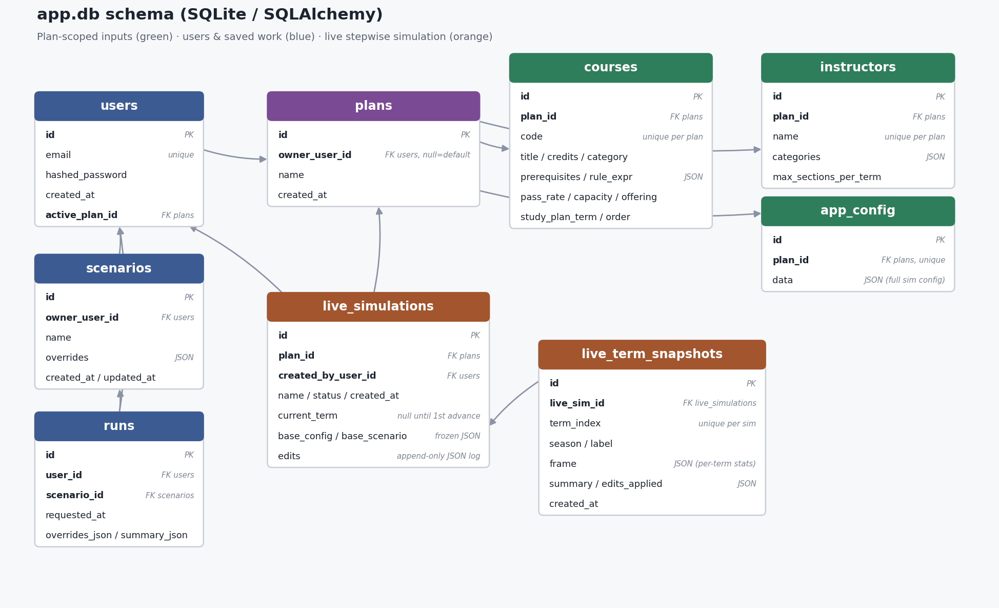
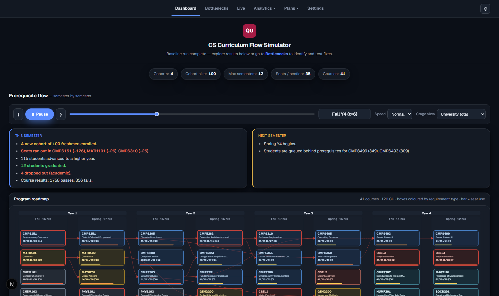
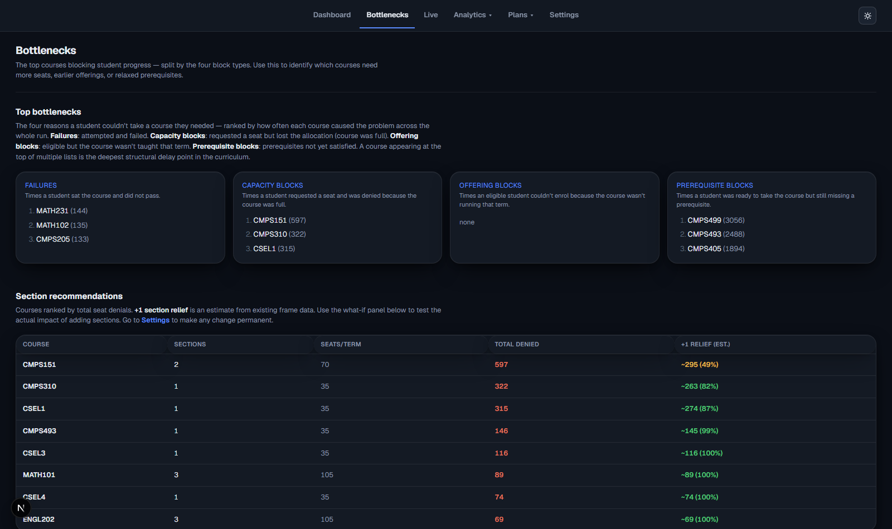
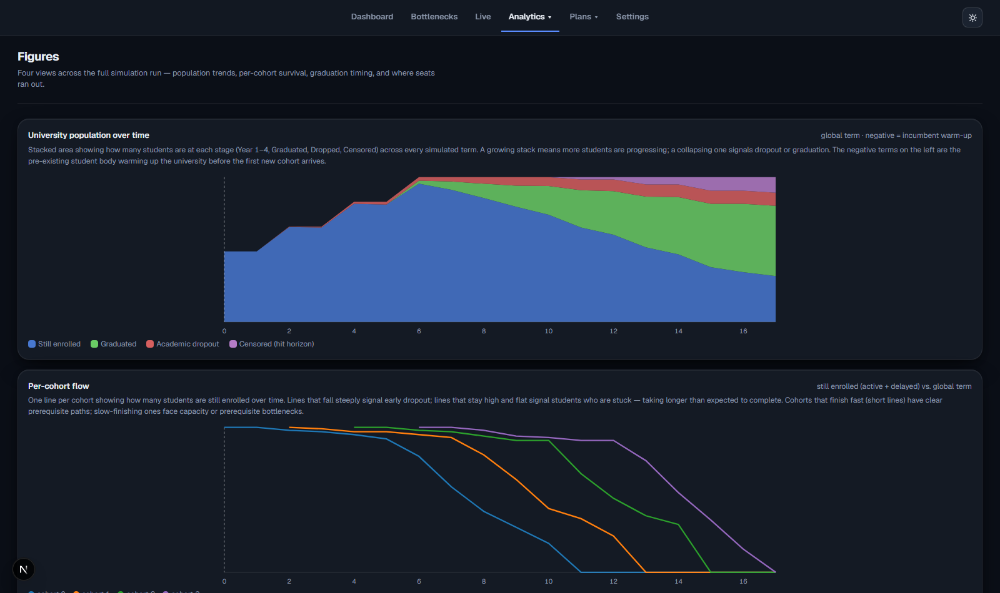
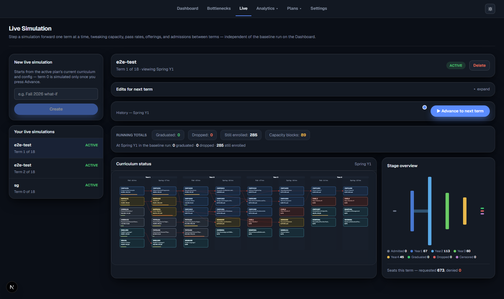

# INTERNSHIP PROGRESS REPORT (Form 2-2)

*(To Be Filed at the Completion of 1/2 of the Internship Period)*

## INTERN'S STATEMENT

**Intern's Name:** Najeeb Abdi

### 1. Describe what you did during this period.

**Database schema** (`src/db_models.py`) — one `Plan` owns its own `Course`/`AppConfig` rows so multiple curricula can be stored side by side without their data colliding; `User.active_plan_id` makes plan selection per-user rather than a single global mutable baseline.

**Dashboard** — the program roadmap animates term by term as the simulation runs, showing seat usage and status per course, colored by requirement type, with a running narrative of what happened each semester.

**Analytics** — the Bottlenecks page ranks courses by which of the four block signals (failure, capacity, offering, prerequisite) delays students most, and the Figures page charts population and per-cohort survival over the full run.

**Live Simulation** — a separate stepwise mode that advances one term at a time so an admin can review a term and edit capacity/policy knobs before advancing.

This period was spent building a discrete-term, agent-based simulation of Qatar University's
Computer Science curriculum: modeling how students move through prerequisite chains,
registration priority, and course capacity over up to 12 semesters, with the goal of identifying
which bottlenecks cause delay or non-completion.

I chose an agent-based design over a simpler aggregate/cohort-flow model because the research
question depends on each student's individual completed-course history — which prerequisites
they personally satisfy, their own GPA and attempt count — not just cohort-level totals. Tracking
per-student state was a requirement, not a convenience.

**Week 1: Core Simulation Engine**

I set up the project and built the core Python simulation engine from scratch:

- A discrete-term loop that advances student agents through registration, seat allocation, and
  pass/fail outcomes each semester.
- A multi-cohort model where a new cohort is admitted every year and all cohorts compete for one
  shared pool of course seats.
- GPA-driven dropout logic and capacity-bottleneck tracking for the CS core sequence.
- A `random.Random(seed + student_id)` stream per student, so a run is fully reproducible and one
  student's result never depends on the order other students are processed in — this matters
  later for attributing a change in results to a specific config change rather than random noise.
- Initial documentation (technical design doc and README) describing the model's assumptions.

**Week 2: Full-Stack Dashboard**

I moved from a script-only engine to a full product:

- Built a FastAPI backend on top of the simulation engine, a database layer
  (SQLAlchemy/SQLite) with JWT authentication, and a Next.js/React frontend dashboard. I chose
  FastAPI + SQLAlchemy specifically so the same simulation engine could be called identically
  from a CLI script and from an HTTP endpoint, with no duplicated logic between them.
- On the frontend: an animated curriculum graph that plays back the simulation term by term, the
  existing static analytics figures ported into React/SVG components, and a prerequisite-network
  diagram.
- Added a Scenario Builder for what-if experiments, a Plan Builder wizard for creating alternate
  curricula from scratch, a Settings page with full CRUD on courses/instructors, a
  capacity-planning module checking both seat and instructor staffing feasibility, a light/dark
  theme with a visual design pass, and a deployment configuration for hosting the app on Render.

*Challenge:* generalizing the engine from a hardcoded Fall/Spring cycle to also support optional
Winter/Summer terms broke a formula I had written in Week 1. A student's simulation horizon was
computed as `entry_term + max_terms`, which is only correct if every term counts toward a
student's semester budget. Once optional terms existed, that formula truncated the simulation
window and could cut a student off before they had actually used all of their real
(mandatory-term-only) semesters.

I fixed it by replacing every call site with a dedicated `mandatory_horizon_end_term()` helper
that walks the calendar counting only mandatory terms, and by giving each student a stateful
`personal_semester` counter that only increments on a mandatory term, instead of recomputing it
from `current_term - entry_term`. I caught the bug by adding a scenario with optional terms
enabled and comparing enrollment before and after.

**Week 3: Live Simulation + Scope Simplification**

I added a "Live Simulation" mode that runs one semester at a time instead of the whole window at
once, so an admin can review a term's results, adjust capacity/policy knobs, and manually advance
to the next term — closer to how a real academic-planning workflow works.

*Challenge:* my first instinct was to advance the live simulation by mutating the simulator's
in-memory state one term at a time and saving a snapshot after each step. Partway through, I
realized this made it impossible to guarantee that an edit made now (e.g., adding a course
section) would never retroactively change a term that had already been reviewed and saved
earlier — which breaks the whole point of a term-by-term review tool.

I re-architected it around a pure replay model instead: every "advance" call replays the engine
from term 0 with the full, current list of edits (each tagged with the term it takes effect
from), so a term already saved is guaranteed to reproduce byte-identically no matter how many
later edits are added. I verified this with an automated test that adds an edit after the fact
and asserts the earlier snapshot's frame is unchanged, rather than just checking it by hand.

After that, I did a significant simplification pass. After reviewing what was actually
load-bearing for the research question, I removed authentication, the Scenario Builder, the
Capacity Planning page, and the instructor-staffing model to cut the product down to its core
value, and added an inline "what-if" panel plus capacity-section recommendations directly on the
main dashboard.

**Week 4: UI Refactor**

I refactored the dashboard's navigation and component structure based on usability issues I
noticed while using the tool myself:

- Extracted a dedicated pre-start screen.
- Moved the what-if panel into the Bottlenecks page and promoted Bottlenecks to primary
  navigation.
- Added live running totals to the in-progress simulation view.

### 2. Describe what you learned during this period.

I learned how to design and build a complete simulation product end-to-end: from the modeling
logic (agent-based simulation, prerequisite/eligibility rule evaluation, seat-allocation policy)
through a REST API layer to an animated frontend dashboard.

- **Backend:** how to structure a FastAPI service with a proper database layer, authentication,
  and a clean separation between the simulation engine and file I/O, so the same engine could be
  called from both a CLI script and an API.
- **Frontend:** how to build animated, data-driven visualizations in React/SVG and how to lay out
  a dashboard so a non-technical user (an academic-planning admin) could actually make sense of
  the output.
- **Concretely new to me:** I did not previously know how to reason about a "replay to guarantee
  determinism" pattern (Week 3's Live Simulation challenge above); I now understand it as a
  general technique for any system that needs to let past state be revisited safely while still
  accepting new input going forward.

**Connection to my coursework.** This project repeatedly pulled on specific things I studied at
QU rather than generic "programming practice":

- **Data Structures and Algorithms** — the prerequisite/eligibility rules are modeled and
  validated as a directed graph with an explicit cycle check (`networkx`-based). I had to
  actually reason about what a cycle in a prerequisite graph would mean for the simulation (a
  course that can never become eligible) rather than just calling a library function.
- **Database Systems** — the schema, where one `Plan` owns its own `Course`/`Config` rows so
  several curricula can be stored side by side without their data colliding, is a direct
  application of relational schema design and normalization.
- **Software Engineering** — the engine/API/CLI separation (`service.py` as a pure,
  file-I/O-free boundary called by both `run.py` and the FastAPI layer) is the
  layered-architecture and separation-of-concerns principle, applied to a real, growing codebase
  instead of a textbook example.
- **Probability and Statistics** — the reproducible, seeded-RNG-per-student design, plus the
  Monte Carlo confidence intervals reported alongside headline metrics, draw directly on the
  coursework covering sampling variance and confidence intervals.

I also learned a project-management lesson I didn't expect going in: after building out a
feature-rich version of the tool (auth, multi-plan support, capacity planning, instructor
modeling), I realized a lot of that complexity wasn't serving the core research question, and I
learned to make the call to strip it back down rather than keep adding features. That
simplification pass was one of the most useful things I did this period; it taught me to keep
re-asking what the tool is actually for, instead of just accumulating functionality.

Working mostly independently on a long-running codebase also pushed me to get better at reading
my own prior design decisions back (via documentation I'd written myself) and staying consistent
with them as the project grew, which is a different skill than writing code for a one-off
assignment.

**Going forward,** the concrete change this makes to how I work: before adding a feature, I will
now explicitly write down which research/product question it serves, the same way I did
retroactively during the Week 3 simplification pass, instead of only doing that check after the
complexity has already piled up. I will also default to a replay-from-source-of-truth design
(rather than incremental in-place mutation) any time a system needs to support "go back and
change something earlier," since debugging the Live Simulation determinism issue cost me more
time than designing it in from the start would have.

**Intern's Name:** Najeeb Abdi &nbsp;&nbsp;&nbsp;&nbsp; **Date:** 04/07/2026

---

## EMPLOYER'S STATEMENT

*Please comment on the intern's work during this period.*

&nbsp;

&nbsp;

&nbsp;

**Industrial Supervisor's Signature:** _______________________ &nbsp;&nbsp;&nbsp;&nbsp; **Date:** _______________
