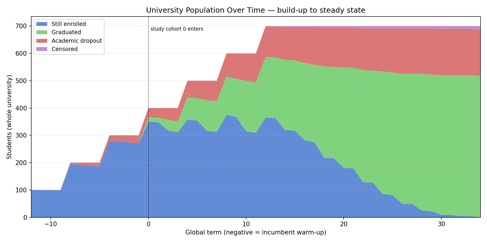
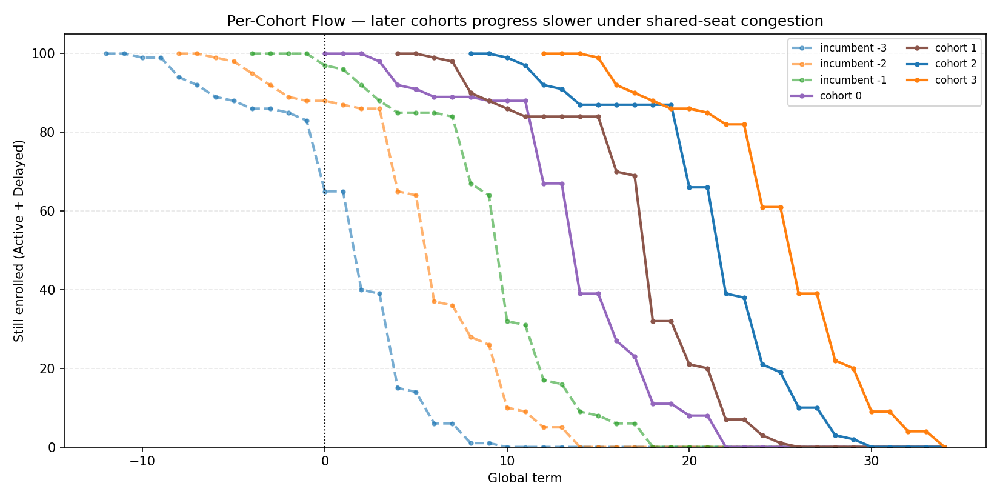
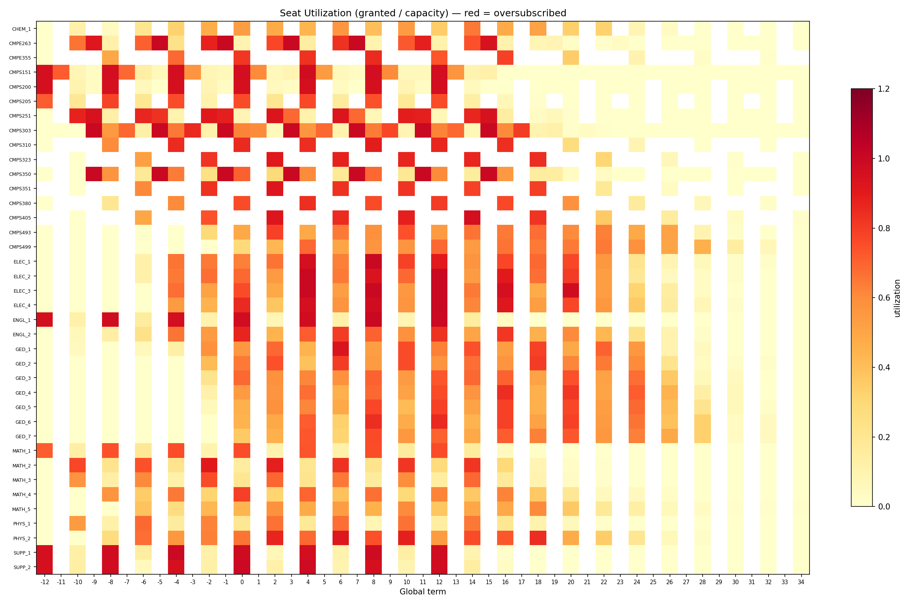

# Prerequisite Chains, Seasonal Scheduling, and Shared-Seat Congestion in the Qatar University Computer Science Curriculum: A Multi-Cohort Discrete-Event Simulation

**Author:** Najeeb Barkhad
**Date:** June 2026
**Version:** 2 (multi-cohort steady-state model)

> **What changed since v1.** Version 1 simulated a single cohort of 100 students in isolation. Version 2 models a **steady-state university**: a new cohort is admitted every year, several incumbent cohorts are seeded before the study window as a warm start, and **all cohorts compete for one shared pool of course seats**. Two further mechanisms are new: a **GPA-driven dropout model** (replacing the single repeated-fail rule), and **section-based capacity** (per-course `sections × seats-per-section`, auto-calibrated to peak demand) replacing the flat per-course seat caps. The headline result of v2 is that, once seat supply is sized realistically to demand, **capacity contention largely disappears and the dominant delay mechanisms are seasonal scheduling and the prerequisite structure** — not the registrar's seat counts.

---

## Abstract

This study uses a discrete-term, agent-based simulation to identify where students lose time in the Qatar University (QU) BSc Computer Science 2024 study plan. Unlike a single-cohort model, the simulator runs a steady-state university: four study cohorts of 100 students enter one per year, three incumbent cohorts are seeded before the study window so gateway courses are already partly occupied, and every cohort competes for a single shared pool of course seats sized by realistic section counts. Each term models course selection, priority seat allocation, stochastic pass/fail, GPA, academic probation, GPA-driven dropout, and graduation. Non-completion is decomposed into four independent signals — course failures, capacity denials, missed seasonal offerings, and unmet prerequisites — so academic difficulty can be separated from structural constraints.

Across 30 random seeds the model graduates **71.6% of study-cohort students within 12 semesters (95% CI [71.0%, 72.2%])**, against QU's published 72.3% six-year benchmark. The central v2 finding is structural: when sections are sized to the 75th percentile of per-term demand, **capacity blocks collapse to a residual handful on introductory and non-major courses** (top capacity block: CMPS 151, 22 events), while the prerequisite and seasonal-offering signals dominate by one to two orders of magnitude. The senior-project compound rule (CMPS 493 → CMPS 499) and the CMPS 303 gateway own the prerequisite-block panel; the six once-a-year courses own the offering-block panel. A capacity-sweep over the binding gateways shows graduation is bound by CMPS 303 and CMPS 350 section supply, not by the dropout parameters. The highest-leverage reforms are therefore adding seasonal offerings for the senior-project gates (CMPS 310) and the shallowest once-a-year course (CMPS 351), and protecting early, on-phase passage through CMPS 303.

---

## 1. Introduction

Graduation rate and time-to-degree are primary indicators of curriculum efficiency. In programs with deep prerequisite chains and seasonally constrained offerings — engineering and computer science especially — structural features of the curriculum can delay students as much as academic difficulty: a student who fails a once-a-year course waits a full year, not a semester.

A single-cohort model (v1 of this study) can expose prerequisite and seasonal effects but cannot represent the one constraint every real registrar manages daily: **a fixed pool of seats shared across all cohorts simultaneously**. A freshman, a sophomore, and a senior all want CMPS 251 in the same Fall term, and priority registration decides who is displaced. Capturing this requires a steady-state, multi-cohort model in which cohorts overlap in time and contend for the same sections.

Qatar University's 2024 CS study plan requires 120 credit hours across 38 courses over a nominal 8-semester path. Six upper-curriculum courses are offered only once per year: CMPS 323 (Algorithms), CMPS 405 (Operating Systems), and CMPS 351 (Database Systems) in Spring; CMPS 310 (Software Engineering), CMPS 380 (Cybersecurity), and CMPE 355 (Computer Networks I) in Fall. The senior-project sequence (CMPS 493 → CMPS 499) carries a compound eligibility rule (84 CH plus specific upper-level courses). This study quantifies the resulting delay and answers: **which prerequisite chains and scheduling constraints contribute most to student delay and non-completion, and does shared-seat congestion change the answer?**

---

## 2. Related Work

Saltzman et al. (2019) showed that discrete-event simulation reveals curriculum bottlenecks invisible to aggregate enrollment statistics, demonstrating that department-level graduation rates mask course-level congestion. Star et al. (CSULB) modeled student flow through the CSU Long Beach College of Engineering using 15-unit curriculum blocks and found that admission or load shocks take roughly six years to propagate through a stable curriculum — a steady-state lag the present multi-cohort model reproduces directly through its warm-start incumbents.

Duarte and Márquez (n.d.) present an aggregate mathematical model of student flow through an engineering curriculum at the Universidad Nacional de Colombia, estimating level populations, graduate counts, and graduation times while accounting for repetition, approval, and transfer, validated against historical enrollment data. Where their model tracks pooled counts flowing between levels, the present study is agent-based: each of 400 study-cohort students (plus 300 incumbents) is simulated individually, so delay can be attributed to a specific course-level constraint — offering season, shared-seat capacity, or prerequisite chain — rather than inferred from pooled rates.

No publicly available QU study disaggregates graduation delay by course-level constraint type under shared-seat contention, which is the contribution here.

---

## 3. Methodology

### 3.1 Multi-Cohort Steady-State Model

The simulator runs a **global clock** spanning incumbent warm-up and the study window. Four study cohorts of 100 students enter at global terms 0, 2, 4, 6 (one per academic year); three incumbent cohorts of 100 enter at terms −2, −4, −6 as a warm start, so by the time study cohort 0 arrives the gateway courses are already partly occupied and seat contention is realistic from term 0 rather than ramping up from an empty university. The university therefore reaches a genuine steady state in which freshmen, sophomores, and seniors coexist and compete.

- **Personal vs. global time.** Graduation, delay, and censoring are judged on each student's *personal* clock (`personal_semester = global_term − entry_term + 1`), so every student receives exactly `max_terms = 12` semesters from their own admission regardless of when they entered.
- **Headline metrics are scoped to study cohorts** (entry term ≥ 0; 400 students). Incumbents are a warm-start device and appear only in the per-cohort ledger.
- **Determinism (CRN).** Each student owns a random stream seeded by `seed + student_id` with a globally unique id, so results are reproducible and scenario differences reflect structure, not noise.

### 3.2 Per-Term Loop (three phases)

Each term, all active students across all cohorts proceed through:

1. **Desired enrollment.** Each student builds a priority-ordered list — retakes, then newly eligible required CS courses in study-plan order, then CS electives (≥ 60 CH), then non-CS filler — capped at 18 CH (12 CH on probation).
2. **Shared-pool seat allocation.** Requesters for each course are pooled across *all cohorts* and ranked by registration tier (derived from completed credit hours, matching QU's priority-registration policy) with a stable random tiebreak. The first `sections × seats-per-section` are granted; the rest receive a *capacity block*. Seniors from older cohorts automatically outrank freshmen.
3. **Outcome resolution.** Pass/fail is drawn from a base course pass rate shifted by the student's fixed ability score (`clip(base + ability, 0.05, 0.98)`); passing students draw a letter grade from a difficulty-tier distribution; GPA, probation, and dropout are updated.

### 3.3 Section-Based Capacity (new in v2)

Per-term seats for a course are `course_sections[code] × seats_per_section` (35 seats/section). Section counts are auto-calibrated by `scripts/size_sections.py` to the **75th percentile of per-term demand** for CS courses (so seats bind on CS gateways during enrolment bulges but not chronically), with non-CS courses sized to full peak so they never bottleneck. This replaces v1's flat per-course caps with realistic, course-specific, hand-tunable section counts: relieving a bottleneck means *adding a section*, exactly the lever a department controls.

Two gateways were hand-raised one section above the demand-percentile baseline — **CMPS 303 (2 → 3)** and **CMPS 350 (2 → 3)** — because both were capacity-binding and gate downstream progress (CMPS 303 unlocks three upper courses; CMPS 350 satisfies the CMPS 493 compound rule). This lifts the 30-seed graduation rate from 70.8% to 71.6%, toward the 72.3% benchmark (see §5.4).

### 3.4 GPA-Driven Dropout (new in v2)

V1 dropped students only after repeated failures of one course. V2 ties dropout to the GPA/probation system with two independent causes:

- **Primary — chronic low GPA.** Once a student has accumulated `≥ 25 CH`, each term with GPA below 2.0 carries a per-term hazard `base_hazard × (1 + (2.0 − GPA))` that grows with severity and is **doubled in the first four semesters** (early attrition is front-loaded, as in real programs).
- **Secondary — stuck on a gateway.** Failing one course three times still drops a student with probability 0.15 per further failure, even if overall GPA is survivable.

**Calibration scope.** The only QU anchor is the *aggregate* 72.3% twelve-semester graduation rate; the open data is semester-level counts, not student histories, so dropout *timing* cannot be validated. The early-semester front-loading is a face-validity assumption, not a data fit. Critically, a sweep shows `base_hazard` does **not** control the graduation rate — lowering it merely trades *dropped* for *censored* students (weak-GPA students who do not finish either way). Graduation is bound by gateway seat supply, not by the dropout parameters (§5.4).

### 3.5 Four Block Signals

Four signals are tracked independently and never aggregated; each has a per-cohort variant for "where did they get stuck" post-mortems.

| Signal | What it counts | Intervention type |
|---|---|---|
| `fail_counts` | Student attempted and failed | Course difficulty, teaching quality |
| `capacity_block_counts` | Eligible student denied a shared seat | Section capacity expansion |
| `offering_block_counts` | Eligible student, course not taught this term | Add offering season |
| `prereq_block_counts` | Student lacks prerequisites | Upstream course bottleneck |

**Unit note.** The four are *not* comparable in magnitude. Failures count per-attempt events; offering and prerequisite blocks accumulate one event per active eligible student per term they remain blocked, so they run one to two orders of magnitude larger. Comparisons are meaningful *within* each panel (across courses), not *between* panels. Multi-cohort totals are also larger than v1's single-cohort counts because four study cohorts plus three incumbents contribute events.

### 3.6 Curriculum Structure

The 2024 QU CS study plan is encoded as 38 courses totalling exactly 120 CH. The CS-core prerequisite structure (from the official 2024 CS Prerequisite Flowchart):

| Course | Prerequisites | Offering |
|---|---|---|
| CMPS 151 Programming Concepts | — | Fall + Spring |
| CMPS 251 Object-Oriented Programming | CMPS 151 | Fall + Spring |
| CMPS 303 Data Structures | CMPS 251 | Fall + Spring |
| CMPS 350 Web Development | CMPS 251 | Fall + Spring |
| CMPS 351 Database Systems | CMPS 251 | **Spring only** |
| CMPS 310 Software Engineering | CMPS 251 | **Fall only** |
| CMPE 263 Computer Architecture | CMPS 151, CMPS 205 | Fall + Spring |
| CMPE 355 Computer Networks I | CMPE 263 | **Fall only** |
| CMPS 380 Cybersecurity | CMPS 303 | **Fall only** |
| CMPS 323 Design & Analysis of Algorithms | CMPS 303, CMPS 205 | **Spring only** |
| CMPS 405 Operating Systems | CMPS 303, CMPE 263 | **Spring only** |
| CMPS 493 Senior Project I | *compound rule* | Fall + Spring |
| CMPS 499 Senior Project II | CMPS 493 | Fall + Spring |

- **The CMPS 303 gateway.** CMPS 303 is the prerequisite for CMPS 323, CMPS 380, and CMPS 405 — the single highest-leverage node in the graph.
- **The senior-project compound rule.** CMPS 493 requires simultaneously ≥ 84 CH, a pass in CMPS 310, and a pass in CMPS 350 *or* CMPS 405; CMPS 499 then requires CMPS 493. This two-course tail plus the credit-hour gate is the curriculum's terminal bottleneck.

### 3.7 External Benchmark

QU publishes aggregate semester-level enrollment and graduation counts via the Qatar Open Data Portal. Two windows were computed: a 4-year (8-semester) rate of 51.5% (Fall 2015–2019 cohorts) and a 6-year (12-semester) rate of 72.3% (Fall 2015–2016). These are downstream validation benchmarks, not simulation inputs.

---

## 4. Results

All figures are generated from the canonical seed (42); point estimates below are from that run, and 30-seed Monte Carlo means with 95% confidence intervals are reported alongside the headline metrics.

### 4.1 Steady-State Outcomes (study cohorts)

| Metric | Single seed | 30-seed mean | 95% CI |
|---|---|---|---|
| Graduation rate (≤ 12 semesters) | **73.5%** | **71.6%** | [71.0%, 72.2%] |
| Academic dropout rate | 23.5% | 24.7% | [24.2%, 25.3%] |
| Censored (hit 12-semester horizon) | 3.0% | 3.6% | [3.3%, 4.0%] |
| Average graduation time | 8.85 sem | 8.85 sem | [8.83, 8.87] |
| On-time rate (≤ 8 semesters) | 36.0% | 34.4% | [33.9%, 34.8%] |
| Ever on academic probation | 20.0% | 21.8% | [21.3%, 22.3%] |
| Mean GPA at graduation | 2.93 | 2.92 | [2.92, 2.93] |

**Comparison with real QU data:**

| Horizon | Simulation (30-seed) | Real QU | Gap |
|---|---|---|---|
| 4-year / 8 semesters | 34.4% (on-time) | 51.5% | −17.1 pp |
| 6-year / 12 semesters | 71.6% | 72.3% | −0.7 pp |

The 12-semester rate sits **0.7 pp below** the QU benchmark, with the benchmark at the upper edge of the 95% CI. The model centers slightly low because it omits two real recovery mechanisms (summer enrolment and course withdrawal); both would relax the seasonal bottlenecks the model identifies, so the direction of the gap is consistent with the findings. The 4-year on-time gap (−17 pp) reaffirms that the nominal 8-semester plan is structurally unachievable for most students under realistic failure and seasonal constraints.

### 4.2 Graduation Time Distribution

**Figure 1** shows semesters-to-graduate for the 294 study-cohort graduates (seed 42).

- A **sharp peak at semester 8** (104 graduates), with 40 graduating on-time-or-early at semester 7. These 144 on-time students (36%) navigate the critical path with no seasonal misalignment.
- The remaining 150 graduates spread across semesters 9–12 (68, 41, 25, 16), a **declining tail** rather than a spike at the horizon: each once-a-year course missed or failed adds a full year, scattering late graduations. That semester 12 is the *smallest* late bar (16) confirms few students are pinned to the final opportunity.
- The structural minimum is set by CMPS 251 → CMPS 303 → CMPS 405 (Spring) → CMPS 493 (compound 84 CH + CMPS 310) → CMPS 499. Because CMPS 310 is Fall-only and CMPS 405 Spring-only, the two senior-project prerequisites cannot clear in one season, forcing a full year between them and placing the realistic minimum at semester 8 — exactly the peak.

### 4.3 University Population Over Time

**Figure 2** stacks the whole-university population (all cohorts) by status against the global term, from the incumbent warm-up (negative terms) through the study window.

- Before term 0, only incumbents are present and the population climbs as study cohorts are admitted; the marked line at term 0 is study cohort 0's entry. The total enrolled band rises to a **steady-state plateau** once several cohorts overlap, then resolves into graduated/dropped/censored bands as each cohort ages out.
- The plateau is the point of the multi-cohort design: seat contention is evaluated against a realistically loaded university, not a single cohort in an empty one. The graduated band (green) grows in annual steps, one per cohort reaching its senior-project window.
- The censored band stays thin (≈ 3.6%), reflecting that with calibrated section supply, few students reach the horizon still merely *waiting* for a seat — most resolve or drop first.

### 4.4 Per-Cohort Flow Under Shared-Seat Congestion

**Figure 3** plots each cohort's still-enrolled head-count against the global term (dashed = incumbent warm-start cohorts).

Per-cohort graduation rates (seed 42):

| Cohort | Type | Graduation | Dropout | Censored | Avg time |
|---|---|---|---|---|---|
| −3 | incumbent | 68.0% | 24.0% | 8.0% | 9.12 |
| −2 | incumbent | 63.0% | 33.0% | 4.0% | 9.02 |
| −1 | incumbent | 67.0% | 29.0% | 4.0% | 8.58 |
| 0 | study | 76.0% | 22.0% | 2.0% | 8.75 |
| 1 | study | 70.0% | 25.0% | 5.0% | 8.79 |
| 2 | study | 79.0% | 18.0% | 3.0% | 8.82 |
| 3 | study | 69.0% | 29.0% | 2.0% | 9.04 |

- The incumbent cohorts post lower graduation rates than the study cohorts — expected, since they enter mid-simulation with no warm start of their own and immediately contend with established seniors; they function as the load that makes study-cohort contention realistic, not as headline subjects.
- Study cohorts vary across a ≈10 pp band (69–79%) at fixed intake and capacity — single-seed cohort-to-cohort noise, not a monotonic decline. This variability is itself the finding behind the admissions recommendation (§4.7): **throughput stability**, not mean graduation rate, is the binding constraint on how large an intake the shared pool can absorb smoothly.

### 4.5 Seat Utilization

**Figure 4** is a course × term heatmap of utilization (granted / capacity); red marks oversubscription.

- Most cells sit well below 1.0: section sizing has matched supply to demand for the bulk of the curriculum. Hot cells concentrate in two places — the **once-a-year courses during their single offering season** (an entire year's eligible pool arrives at once) and a few **high-volume introductory courses** during enrolment bulges (CMPS 151, ENGL 2).
- The heatmap is the visual counterpart to §4.6's collapsed capacity-block panel: oversubscription is now episodic and seasonal, not chronic.

### 4.6 Bottleneck Identification

**Figure 5** shows the four signals as separate panels (seed 42, cumulative over the study window).

**Panel 1 — Failures.** CMPS 405 (293), CMPS 251 (288), CMPS 323 (273), CMPS 151 (241), CMPS 310 (240), CMPS 205 (239). The hard Spring pair (CMPS 405/323, both 0.65) leads, but high-volume early courses (CMPS 251/151/205) accumulate large absolute counts simply because nearly everyone takes them. No single course dominates on difficulty alone.

**Panel 2 — Capacity Blocks.** CMPS 151 (22), ENGL 2 (9), ELEC 2 (6), ELEC 1 (1). **This is the headline change from v1.** With sections sized to the 75th percentile of demand, capacity contention has collapsed to a residual handful on introductory and non-major courses; **not a single binding CS gateway tops this panel.** In v1's flat-cap single-cohort model, CMPS 351 alone drew 58 capacity blocks. The lesson: *capacity was a modeling artifact of unrealistic seat caps, not the curriculum's true constraint.* When seats track demand, the bottleneck moves entirely to prerequisites and seasons.

**Panel 3 — Offering Blocks.** CMPS 310 (879), CMPS 405 (879), CMPS 323 (875), CMPE 355 (873), CMPS 351 (864), CMPS 380 (789). The six once-a-year courses occupy all six top positions, tightly bunched near 800–880 — every off-season term, each eligible student waiting on a once-a-year course accrues an event. These counts dwarf the failure counts, confirming **seasonal scheduling is a far larger source of delay than course difficulty.** CMPS 310 ties for the lead and is uniquely damaging: because it gates the CMPS 493 compound rule, a missed Fall offering postpones senior-project entry a full year.

**Panel 4 — Prerequisite Blocks.** CMPS 499 (4436), CMPS 493 (3807), CMPS 405 (2157), CMPS 323 (2089), CMPS 380 (2085), MATH 5 (1891). CMPS 499/493 dominate: the compound rule holds students prereq-blocked for many terms, and CMPS 499 inherits every one of those terms behind CMPS 493. **Third, fourth, and fifth are CMPS 405 / 323 / 380 — the three courses gated by CMPS 303 — at near-identical counts (2157 / 2089 / 2085).** This lockstep is the unmistakable quantitative fingerprint of the CMPS 303 gateway: one upstream course holding its three dependents in unison.

**Cross-panel summary:**

| Course | Failures | Cap Blocks | Offering Blocks | Prereq Blocks |
|---|---|---|---|---|
| CMPS 310 | ✓ | — | ✓ (1st) | — |
| CMPS 405 | ✓ (1st) | — | ✓ | ✓ (3rd) |
| CMPS 323 | ✓ | — | ✓ | ✓ (4th) |
| CMPS 351 | — | — | ✓ | — |
| CMPS 380 | — | — | ✓ | ✓ (5th) |
| CMPS 303 | ✓ | — | — | (upstream cause) |
| CMPS 499 / 493 | — | — | — | ✓ (1st/2nd) |
| CMPS 151 | ✓ | ✓ (1st) | — | — |

The capacity column is now nearly empty for CS courses — the defining v2 result. Delay lives in the offering and prerequisite columns: the six once-a-year courses, the senior-project compound tail, and the CMPS 303 gateway trio.

### 4.7 Admissions Recommendation

A single-run heuristic scales the recommended intake by the worst-performing health criterion (graduation rate, time-to-degree, seats-denied-per-student, throughput stability). At the current intake of 100, the binding criterion is **throughput stability** (observed 0.50 vs. 0.85 target), recommending a **reduced intake of ≈ 59** to smooth the year-to-year graduation flow through the shared pool. Seats-denied-per-student is far inside target (0.06 vs. 1.0), consistent with §4.6: the shared pool is not seat-starved — it is *rhythm*-constrained by the seasonal and prerequisite structure, which an intake reduction smooths but does not fix. (This is a heuristic, not an optimum; an intake sweep is the rigorous follow-up.)

### 4.8 Curriculum Network

**Figure 6** shows the directed prerequisite graph with node size/colour scaled by failure count.

- **CMPS 303 is the central gateway**, with direct edges to CMPS 323, CMPS 380, and CMPS 405 — the three dependents that carry the highest non-senior-project prereq-block counts in lockstep (§4.6).
- **The path forks then reconverges:** from CMPS 251 the graph splits into the CMPS 303 cluster and the CMPS 310 branch, both of which must complete before CMPS 493. Because CMPS 310 is Fall-only and CMPS 405 Spring-only, the branches cannot clear in one season, structurally enforcing a multi-semester convergence before the senior project.

---

## 5. Discussion

### 5.1 Capacity Was a Modeling Artifact; Structure Is the Real Constraint

The single most important v2 result is what *disappeared*. In the single-cohort, flat-cap model of v1, capacity blocks were a leading signal and CMPS 351 topped them with 58 denials. In the steady-state model with sections sized to demand, the entire CS-course capacity panel collapses — the top capacity block is now CMPS 151 (22), an introductory course, and no binding CS gateway appears at all. This means v1's capacity story was partly an artifact of arbitrary seat caps. When seat supply is allowed to track demand the way a real registrar sizes sections, congestion does not vanish — it **relocates** entirely to the two structural mechanisms the university cannot solve by adding sections: seasonal offerings and prerequisite chains.

### 5.2 Seasonal Scheduling Dominates

The six once-a-year courses occupy all six top positions in the offering-block panel at tightly bunched counts (789–879). Each off-season term, every eligible student waiting on one of these courses accrues a block, and each failure or miss costs a full year rather than a semester. **CMPS 310 (Software Engineering, Fall-only) is the most structurally pivotal** despite tying rather than dominating: because CMPS 493 requires it, the Fall-only restriction is a hard annual gate on senior-project entry. **CMPS 351 (Database, Spring-only)** is the most broadly binding *non-gate* seasonal course because it has the shallowest prerequisite (only CMPS 251) of any once-a-year offering, so the largest pool becomes eligible earliest and funnels into a single Spring window. A shallow prerequisite paired with a once-a-year offering is a worse structural design than a difficult course.

### 5.3 The CMPS 303 Gateway

CMPS 303 gates CMPS 323, CMPS 380, and CMPS 405, and the prereq-block panel shows these three blocked in near-perfect lockstep (2157 / 2089 / 2085). With a 0.71 pass rate, ≈ 29% fail the first attempt; because CMPS 303 is offered both seasons its own recovery is fast, but a one-semester slip lands students out of phase with the once-a-year offerings of its three dependents, converting a one-semester delay into a full-year one. CMPS 303 is a *delay amplifier* — the highest-leverage advising target in the lower curriculum.

### 5.4 Graduation Is Capacity-Structural, Not Dropout-Tuned

A calibration sweep produced a methodologically important negative result: varying `dropout_base_hazard` across 0.15–0.17 left the 30-seed graduation rate essentially flat (≈ 70.7%). Lowering the hazard does not produce more graduates — it converts would-be dropouts into *censored* students who time out at the horizon, because these are low-GPA students who do not complete under either label. Graduation is bound by **gateway seat supply**: raising CMPS 303 (2→3) and CMPS 350 (2→3) by one section each — both genuinely capacity-binding gateways, with CMPS 350 satisfying the CMPS 493 compound rule — lifts the 30-seed rate from 70.8% to 71.6%, with the 72.3% benchmark reaching the top of the CI. This both relieves a documented bottleneck and closes the calibration gap, and it locates the lever correctly: the residual shortfall is structural seasonal delay, not a mis-set dropout probability.

### 5.5 Shared-Seat Congestion and Admissions

The multi-cohort model exposes a constraint a single-cohort model cannot: at fixed capacity, study cohorts vary ≈10 pp in graduation rate (§4.4), and the binding admissions criterion is **throughput stability**, not mean outcome or seat starvation (§4.7). The shared pool is not seat-starved; it is rhythm-constrained by the annual offering cycle and the senior-project tail. Reducing intake smooths the flow, but the durable fix is the same structural reform the bottleneck panels point to — adding seasonal offerings to the gates.

### 5.6 Implications for Curriculum Design

Ordered by expected impact:

1. **Add a Spring offering of CMPS 310 (Software Engineering).** Fall-only and required by the CMPS 493 compound rule, it is a hard annual gate on senior-project entry and ties for the top offering-block count. A second season removes the gate entirely — the highest-impact single change.
2. **Add a Fall offering of CMPS 351 (Database Systems).** The shallowest-prerequisite once-a-year course funnels the largest early-eligible pool into one Spring window; a second season halves accumulated demand per term.
3. **Protect early, on-phase passage through CMPS 303 (Data Structures).** Mandatory early enrollment plus tutoring cuts the gateway cascade at its source, where it costs three dependents a full year apiece.
4. **Split the Spring theory pair (CMPS 323 / CMPS 405).** Adding a Fall section to at least one lets students take one hard 0.65 course per semester instead of both at once, reducing concurrent load and full-year retake penalties.
5. **Size intake to throughput stability, not just to seats.** The shared pool absorbs ≈ 59 cleanly under the current structure; intake reductions smooth the year-to-year graduation rhythm but are a stopgap relative to the seasonal reforms above.

---

## 6. Conclusion

Modeling the QU CS curriculum as a steady-state, multi-cohort university with a shared seat pool overturns the single-cohort capacity story: once sections are sized to demand, **capacity contention collapses to a residual handful on introductory courses, and delay relocates entirely to seasonal scheduling and prerequisite structure.** The offering-block panel is owned by the six once-a-year courses; the prerequisite-block panel by the senior-project compound tail (CMPS 499/493) and the CMPS 303 gateway trio (CMPS 405/323/380) blocked in lockstep. A calibration sweep further shows graduation is bound by gateway seat supply, not by dropout parameters — relieving CMPS 303 and CMPS 350 by one section each closes the gap to QU's benchmark.

The model graduates **71.6% of study-cohort students within 12 semesters (CI [71.0%, 72.2%])** against QU's 72.3% benchmark, validating its structural assumptions. The single highest-impact reform is extending the senior-project gate **CMPS 310** to both semesters; adding a Fall offering of **CMPS 351** is second. For students who do not finish on time, the most likely cause is waiting for a course offered once per year or blocked behind the CMPS 303 gateway — not losing a seat to a classmate.

---

## References

Duarte, O., & Márquez, C. (n.d.). *A model of student flow through the college curriculum*. Universidad Nacional de Colombia.

Qatar University. (2024). *BSc Computer Science 2024 Study Plan, Program Roadmap, and Prerequisite Flowchart*. College of Engineering, Qatar University.

Qatar Open Data Portal. (2024). *QU registered students per semester (Fall 2015 – Spring 2025)*. data.gov.qa.

Qatar Open Data Portal. (2024). *QU graduated students per semester (Fall 2015 – Spring 2024)*. data.gov.qa.

Saltzman, R., Liu, W., & Roeder, T. (2019). Simulating student flow through a university's general education curriculum. In *Proceedings of the Winter Simulation Conference*.

Star, L., Sciortino, A., Deutschman, J., Spralja, K., & Maples, T. (n.d.). *Dynamic model of student flow*. California State University Long Beach, College of Engineering.
