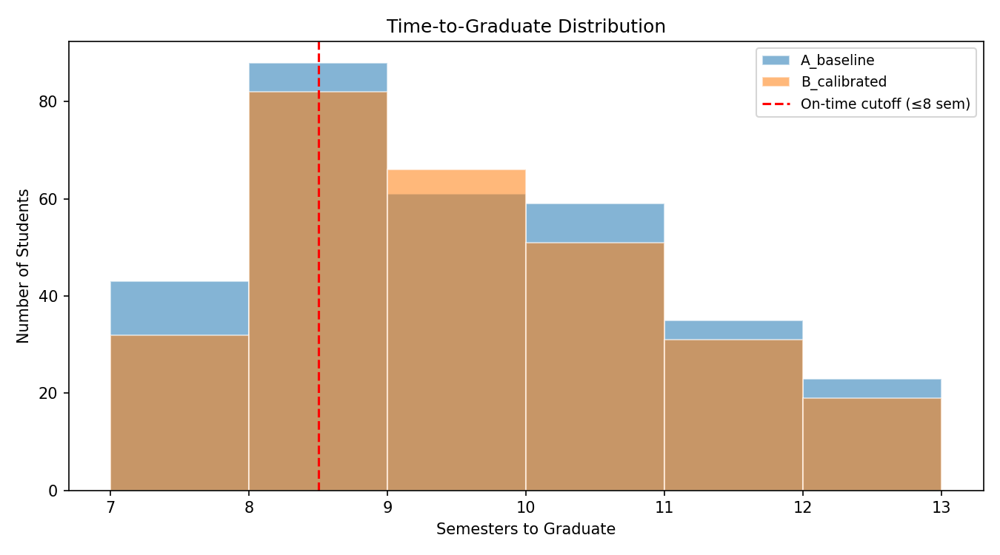
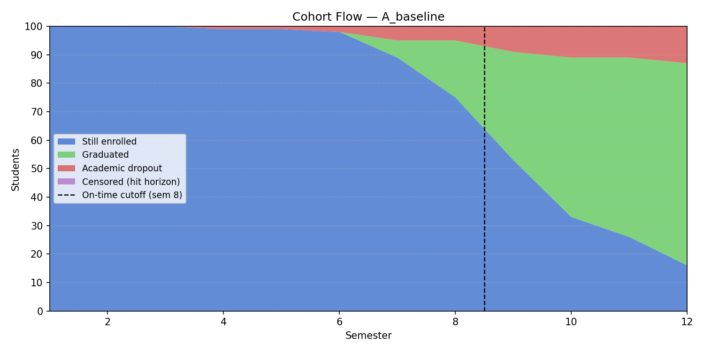
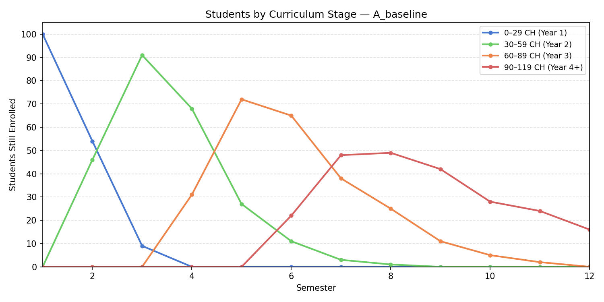
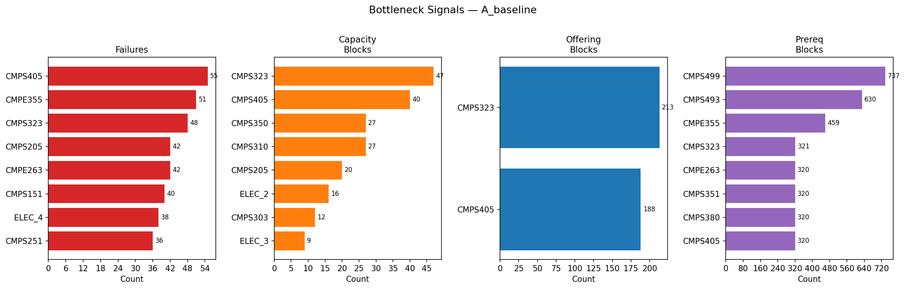
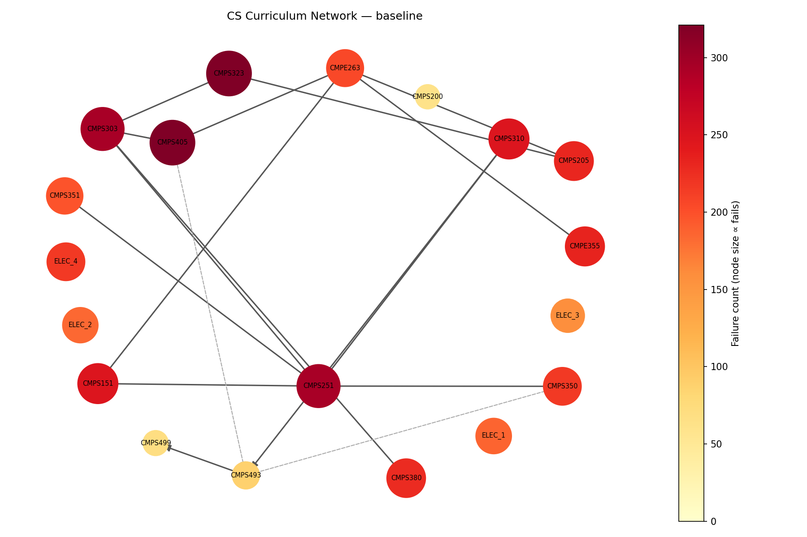

# Identifying Prerequisite Chain and Scheduling Bottlenecks in the Qatar University Computer Science Curriculum: A Discrete-Event Simulation Study

**Author:** Najeeb Barkhad  
**Date:** June 2026  

---

## Abstract

This paper presents a discrete-term stochastic simulation of 100 students progressing through the Qatar University (QU) Bachelor of Science in Computer Science 2024 study plan over a maximum of 12 semesters. The simulation tracks four distinct blocking signals (course failures, capacity denials, seasonal offering mismatches, and unmet prerequisites) to identify which structural features of the curriculum contribute most to student delay and non-completion. Results show a 71% graduation rate within six academic years, an average graduation time of 9.7 semesters, and a 21% on-time rate. Two structural features dominate. First, the **CMPS 303 (Data Structures) gateway**: a single course whose failure simultaneously blocks the three upper-level courses that depend on it (CMPS 323, CMPS 380, and CMPS 405), which together carry the highest prerequisite-block counts in the curriculum outside the senior project sequence. Second, **seasonal scheduling**: six upper-curriculum courses are offered only once per year (CMPS 323, CMPS 405, CMPS 351 in Spring; CMPS 310, CMPS 380, CMPE 355 in Fall), so a single failure forces a full-year wait. CMPS 351 (Database Systems, Spring-only) is the largest single seasonal bottleneck, leading both the capacity-block (58 events) and offering-block (189 events) panels; CMPS 310 (Software Engineering, Fall-only) remains critical because it gates the CMPS 493 senior-project compound rule, and the simulation shows section capacity there is binding: raising CMPS 310 from 35 to 40 seats lifted graduation by four percentage points and cut the censored rate from 19% to 9%. Academic dropout rate is 20%, within the 15–30% face-validity target; relieving the CMPS 310 capacity constraint converted students who previously timed out *waiting* (censored) into students who reach their courses and sometimes *fail* them, a net gain for completion. The simulation implements grade replacement: when a student retakes and passes a previously failed course, all prior F attempts are removed from the GPA denominator, holding the probation rate to 17%, within the 15–25% face-validity target. The simulated 12-semester graduation rate of 71% sits just 1.3 percentage points below QU's published 6-year benchmark of 72.3%.

---

## 1. Introduction

Graduation rate and time-to-degree are primary indicators of curriculum efficiency in higher education. In programs with deep prerequisite chains and seasonally constrained course offerings, such as engineering and computer science, structural features of the curriculum can delay students as much as academic difficulty. A student who fails a once-a-year course does not retake it the following semester; they wait an entire year.

Qatar University's 2024 CS study plan requires 120 credit hours across 38 courses over a nominal 8-semester path. Several upper-curriculum courses are offered only once per year: CMPS 323 (Algorithms), CMPS 405 (Operating Systems), and CMPS 351 (Database Systems) in Spring; CMPS 310 (Software Engineering), CMPS 380 (Cybersecurity), and CMPE 355 (Computer Networks) in Fall. The senior project sequence (CMPS 493 → CMPS 499) carries a compound eligibility rule requiring 84 completed credit hours and prior completion of specific upper-level courses. These structural features create a narrow critical path where a single failure can cascade into multi-year delays.

This study builds a simulation to quantify these effects and answer the research question: **which prerequisite chains and scheduling constraints contribute most to student delay and non-completion in the QU CS curriculum?**

---

## 2. Related Work

Saltzman et al. (2019) demonstrated that discrete-event simulation can reveal curriculum bottlenecks invisible to aggregate enrollment statistics, showing that department-level graduation rates mask course-level congestion effects. Star et al. (CSULB) applied a similar approach to the California State University Long Beach College of Engineering, using curriculum blocks of 15 units to model student flow and quantify the impact of admission shocks on enrolled student counts. Their study found that changes in load or admission size take six years to propagate through a stable curriculum, consistent with the long lag effects observed in the present simulation.

Duarte and Márquez (n.d.) present a mathematical model of student flow through an engineering curriculum at the Universidad Nacional de Colombia, estimating the number of students at each level, the number of graduates, and graduation times while accounting for course cancellation, repetition, approval, and transfers. Their model is validated against historical institutional enrollment data. Where their approach is aggregate, tracking counts of students flowing between curriculum levels, the present study is agent-based, simulating each of 100 students individually so that delay can be attributed to a specific course-level constraint (offering season, capacity, or prerequisite) rather than inferred from pooled flow rates.

Existing QU research on student outcomes focuses on aggregate institutional indicators. No publicly available study disaggregates graduation delay by course-level constraint type (offering schedule vs. capacity vs. prerequisite chain), which is the primary contribution of the present work.

---

## 3. Methodology

### 3.1 Simulation Model

The simulator processes a cohort of 100 students through alternating Fall and Spring semesters for up to 12 terms. Each term executes three sequential phases.

**Phase 1: Desired enrollment.** Each active student builds a priority-ordered list of courses to attempt: (1) retakes of previously failed courses, (2) newly eligible required CS courses in study-plan order, (3) CS electives once ≥ 60 credit hours have been completed, (4) non-CS filler courses. Load is capped at 18 CH per semester (12 CH for students on academic probation).

**Phase 2: Seat allocation.** When demand for a course exceeds its section capacity, students are ranked by registration tier (derived from completed credit hours, matching QU's priority registration policy) with random tiebreaking. Students denied a seat receive a *capacity block* event.

**Phase 3: Outcome resolution.** Each enrolled student's pass/fail outcome is drawn stochastically using a base course pass rate shifted by that student's fixed ability score (`effective_rate = clip(base_rate + ability, 0.05, 0.98)`). Passing students receive a letter grade from a difficulty-tier distribution. A student who fails the same course four times faces a 25% probability of academic withdrawal per additional failure.

**Common Random Numbers (CRN):** Each student owns a dedicated random stream seeded by `seed + student_id`, re-instantiated identically at the start of each scenario, ensuring scenario differences reflect structure rather than noise.

### 3.2 Four Block Signals

Four signals are tracked independently and never aggregated, as they represent different causal mechanisms requiring different interventions:

| Signal | What it counts | Intervention type |
|---|---|---|
| `fail_counts` | Student attempted and failed | Course difficulty, teaching quality |
| `capacity_block_counts` | Eligible student denied a seat | Section capacity expansion |
| `offering_block_counts` | Eligible student, course not taught this term | Add offering season |
| `prereq_block_counts` | Student lacks prerequisites | Upstream course bottleneck |

**Unit note:** The four signals are *not* directly comparable in magnitude. Failures count per-attempt events; offering and prerequisite blocks accumulate one event per active eligible student per term they remain blocked. A Spring-only course therefore accrues offering-block events every Fall it goes untaken, which is why these counts run an order of magnitude larger than failure counts. Comparisons are meaningful *within* each panel (across courses), not *between* panels.

### 3.3 Curriculum Structure

The 2024 QU CS study plan is encoded as 38 courses totalling exactly 120 credit hours. The CS-core prerequisite structure, taken from the official 2024 CS Prerequisite Flowchart, is:

| Course | Prerequisites | Offering |
|---|---|---|
| CMPS 151 Programming Concepts | — | Fall + Spring |
| CMPS 200 Computer Ethics | — | Fall + Spring |
| CMPS 205 Discrete Structures | — | Fall + Spring |
| CMPS 251 Object-Oriented Programming | CMPS 151 | Fall + Spring |
| CMPS 303 Data Structures | CMPS 251 | Fall + Spring |
| CMPS 350 Web Development | CMPS 251 | Fall + Spring |
| CMPS 351 Database Systems | CMPS 251 | **Spring only** |
| CMPS 310 Software Engineering | CMPS 251 | **Fall only** |
| CMPE 263 Computer Architecture | CMPS 151, CMPS 205 | Fall + Spring |
| CMPE 355 Computer Networks I | CMPE 263 | **Fall only** |
| CMPS 380 Cybersecurity Fundamentals | CMPS 303 | **Fall only** |
| CMPS 323 Design & Analysis of Algorithms | CMPS 303, CMPS 205 | **Spring only** |
| CMPS 405 Operating Systems | CMPS 303, CMPE 263 | **Spring only** |
| CMPS 493 Senior Project I | *compound rule* (see below) | Fall + Spring |
| CMPS 499 Senior Project II | CMPS 493 | Fall + Spring |

**The CMPS 303 gateway.** CMPS 303 (Data Structures) is the prerequisite for three upper-level courses: CMPS 380, CMPS 323, and CMPS 405. It is the single highest-leverage node in the prerequisite graph: a failure or deferral here blocks all three simultaneously.

**The senior-project compound rule.** CMPS 493 requires, simultaneously: ≥ 84 completed credit hours, a pass in CMPS 310, and a pass in CMPS 350 *or* CMPS 405. CMPS 499 then requires CMPS 493. This two-course tail, combined with the credit-hour gate, is the curriculum's terminal bottleneck.

### 3.4 Assumptions

All pass rates and capacities are assumed; no per-course historical data is publicly available for QU CS programs. Values were set to reflect course difficulty reputation and section-size norms.

**Pass rates (key courses):**

| Course | Pass Rate | Rationale |
|---|---|---|
| CMPS 151 Programming Concepts | 0.78 | CS1 weed-out; global ~67%, QU-filtered higher |
| CMPS 205 Discrete Structures | 0.76 | Math-heavy; real struggle for CS students |
| CMPS 251 OOP | 0.72 | First true major course; high attempt volume |
| CMPS 303 Data Structures | 0.71 | Known gateway difficulty |
| CMPS 350 Web Development | 0.76 | Project-based; moderate difficulty |
| CMPS 310 Software Engineering | 0.72 | Project course; Fall-only |
| CMPS 351 Database Systems | 0.75 | Spring-only |
| CMPS 380 Cybersecurity | 0.75 | Fall-only |
| CMPE 263 Computer Architecture | 0.76 | Hardware fundamentals |
| CMPE 355 Computer Networks I | 0.72 | Fall-only; difficulty-driven |
| CMPS 323 Algorithms | 0.65 | Hardest theory course; Spring-only |
| CMPS 405 Operating Systems | 0.65 | Spring-only; paired with CMPS 323 |
| CMPS 493 / 499 Senior Projects | 0.88 / 0.90 | High pass rate by design |

**Section capacities (CS-core binding courses; all non-CS pseudo-courses set to 100):**

| Course | Capacity | Course | Capacity |
|---|---|---|---|
| CMPS 205 | 70 | CMPS 351 | 40 |
| CMPS 251 | 70 | CMPS 380 | 40 |
| CMPS 303 | 40 | CMPS 323 | 40 |
| CMPS 350 | 35 | CMPS 405 | 40 |
| CMPE 263 | 35 | CMPE 355 | 40 |
| CMPS 310 | 40 | CMPS 493 | 30 |
| | | CMPS 499 | 30 |

**GPA model:** Cumulative GPA = Σ(grade points × credits) / Σ(all attempted credits), F = 0.0 points included. **Grade replacement:** when a student retakes and passes a previously failed course, all prior F attempts for that course are removed from the GPA denominator (F = 0.0 pts, so the numerator is unaffected). Only the passing grade counts toward GPA. This models QU's grade improvement policy and is the primary reason the simulation's probation rate (16%) falls within the face-validity target of 15–25%. Without grade replacement, probation exceeded 30%, one early F on a 4-CH course would permanently drag the GPA denominator. Probation triggers when completed CH ≥ 25 and GPA < 2.0. A grade of D or better satisfies any prerequisite.

### 3.5 External Benchmark

Qatar University publishes aggregate semester-level enrollment and graduation counts through the Qatar Open Data Portal. Two graduation-rate windows were computed:

| Horizon | Cohorts used | Real QU rate |
|---|---|---|
| 4-year (8 semesters) | Fall 2015–2019 | 51.5% |
| 6-year (12 semesters) | Fall 2015–2016 | 72.3% |

Rates are computed as (CS graduates within the window) / (CS undergrads enrolled in the entry Fall), using aggregate public data. The 6-year window is restricted to Fall 2015–2016 entry cohorts because later cohorts' 12-semester windows overlap with a large post-2019 graduation surge: adding Fall 2017 produces a rate above 100%, since the aggregate data does not tag graduates to their original entry year. All figures are used as downstream validation benchmarks only, they are not inputs to the simulation. Validating a curriculum-flow model against historical institutional data follows established practice (Duarte & Márquez, n.d.).

---

## 4. Results

### 4.1 Overall Cohort Outcomes

| Metric | A_baseline |
|---|---|
| Graduation rate (within 12 semesters) | **71.0%** |
| Academic dropout rate (repeated-fail rule) | 20.0% |
| Censored (hit 12-semester horizon) | 9.0% |
| Average graduation time | 9.7 semesters |
| On-time rate (≤ 8 semesters) | 21.0% |
| Ever on academic probation | 17.0% |
| Mean GPA at graduation | 2.93 |

**Comparison with real QU data:**

| Horizon | Simulation | Real QU | Gap |
|---|---|---|---|
| 4-year / 8 semesters | 21% (on-time) | 51.5% | −30.5 pp |
| 6-year / 12 semesters | 71% | 72.3% | −1.3 pp |

The simulation's 12-semester graduation rate (71%) is within 1.3 percentage points of QU's 6-year benchmark. Notably, the dropout and censored rates trade off against each other: with CMPS 310 capacity raised to 40 seats, students who previously timed out *waiting* for a seat (censored) instead reach their courses and resolve them, most passing, some failing, which simultaneously lifts graduation to 71%, drops the censored rate to 9%, and raises the academic-dropout rate to 20% (now within the 15–30% face-validity target). The 4-year gap (−30.5 pp) remains wide, confirming that the nominal 8-semester plan is structurally unachievable for most students under realistic failure and seasonal-restriction assumptions.

---

### 4.2 Graduation Time Distribution

**Figure 1** shows the distribution of semesters-to-graduate for all graduating students.

Key observations:
- The distribution has a **sharp peak at semester 8** (19 of 71 graduates), with two more graduating earlier at semester 7. These 21 on-time students are the narrow slice who navigate the critical path with no seasonal misalignment, securing CMPS 310 in Fall and CMPS 405 in the immediately following Spring without a single year-long wait.
- The remaining 50 graduates are **spread fairly evenly across semesters 9–12** (12, 15, 12, 11), with a mild secondary peak at semester 10. This long, flat tail, rather than a spike at any single late term, is the signature of seasonal delay: each once-a-year course a student misses or fails adds a full year, scattering graduations across the back half of the horizon rather than clustering them. Notably, semester 12 is the *smallest* of the late bars (11), confirming that few students are pinned to the very last opportunity before the horizon.
- The structural minimum graduation time, even with no failures, is constrained by the chain CMPS 251 → CMPS 303 → CMPS 405 (Spring) → CMPS 493 (compound 84 CH + CMPS 310 rule) → CMPS 499. Because CMPS 310 is Fall-only and required for CMPS 493, while CMPS 405 is Spring-only, the two senior-project prerequisites cannot both be cleared in the same season, forcing at least a full academic year between them and placing the realistic minimum at 8 semesters, which is exactly where the distribution peaks. Any single failure on a once-a-year course pushes graduation to semester 10 or later.

---

### 4.3 Cohort Survivorship

**Figure 2** shows cohort flow across all 12 semesters as a stacked area chart.

Key observations:
- The **enrolled band** holds near its full size through the lower curriculum (semesters 1–4, ~100 students still active), then declines in two overlapping waves: a gentle withdrawal wave from around semester 5 (98 → 91 across semesters 5–7), and a steep graduation wave from semester 8 onward as students clear the senior-project sequence. By semester 12 only 9 remain enrolled, the censored group.
- **Academic dropouts** (20% overall) first appear at semester 5, the earliest a student can fail the same course the four times the dropout rule requires, and then accumulate steadily through semester 12, with roughly half (11 of 20) occurring by semester 8. They concentrate where students first hit the harder courses: CMPS 251 (0.72, the first high-volume major course), CMPS 303 (0.71), and the Spring-only CMPS 323 / CMPS 405 (both 0.65).
- The **graduated band** grows only from semester 8, remaining near zero through semesters 1–7 (just 2 graduates by semester 7). This confirms that the curriculum structure systematically places graduation in Year 4 at the earliest, and in Year 5 for most students.
- The **censored band** (9%) at semester 12 represents students who were still progressing academically, typically waiting on a once-a-year course (CMPS 351/323/405 in Spring; CMPS 310/380/355 in Fall) or not yet satisfying the CMPS 493 compound rule, but ran out of time. This band is small relative to the dropout band: once the CMPS 310 capacity constraint was relaxed, most students who would otherwise have been left waiting at the horizon instead reach and resolve their remaining courses before semester 12.

---

### 4.4 Students by Curriculum Stage

**Figure 3** tracks enrolled students across four credit-hour bands over time, showing *where* in the curriculum students are concentrated each semester.

Key observations:

- **0–29 CH (Year 1, blue):** Drains rapidly, from the full cohort at semester 1 to roughly 14 students by semester 3, and empty by semester 5. The introductory sequence (CMPS 151, mathematics, general education) is completed without major difficulty; high pass rates and ample section capacity mean few students are held back here.

- **30–59 CH (Year 2, green):** Peaks sharply at semester 3 (≈86 students) and drains through semesters 4–7. This band captures the CMPS 251 → CMPS 303 spine. Students who fail CMPS 251 (0.72) or CMPS 303 (0.71) remain in this band an additional semester. Because CMPS 303 gates the three courses CMPS 323, CMPS 380, and CMPS 405, a failure here has the widest downstream effect of any single course.

- **60–89 CH (Year 3, orange):** Forms a broad hump that peaks at semesters 5–6 (≈58 students) and persists through semester 9. Students in this band are eligible for the once-a-year upper courses, CMPS 323 and CMPS 405 (Spring) and CMPS 380 and CMPE 355 (Fall), and they queue across both seasons. A student who fails any of these must wait a full year to retry, keeping them in the 60–89 CH band far longer than the study plan assumes.

- **90–119 CH (Year 4+, red):** Builds rapidly from semester 6, peaking at roughly 43 students around semesters 7–8, then drains as students graduate out. Entry to this band is gated by the CMPS 493 compound rule (84 CH + CMPS 310 + CMPS 350/405) combined with the Fall-only CMPS 310 requirement: a student who misses CMPS 310 in Fall cannot satisfy the compound rule until the following year, which is what stretches the band's drain-down across semesters 9–12 rather than clearing it quickly.

The Year 3 band (orange) is the most diagnostic feature of this chart. Its broad hump, peaking at semesters 5–6 and persisting through semester 9, shows that students are clearing the 60 CH threshold but then queuing through once-a-year courses spread across both seasons before they can advance to the senior project stage.

---

### 4.5 Bottleneck Identification

**Figure 4** shows the four bottleneck signals as separate horizontal bar charts. Each panel measures a different mechanism; cross-panel magnitude comparisons are not meaningful, but the pattern of which courses appear in which panels is the key finding.

#### Panel 1: Failures (red)

| Course | Cumulative Fail Events |
|---|---|
| CMPS 323 Algorithms | 49 |
| CMPS 405 Operating Systems | 47 |
| CMPE 263 Computer Architecture | 45 |
| CMPS 303 Data Structures | 45 |
| CMPS 251 OOP | 44 |

CMPS 323 leads failures: at a 0.65 pass rate, roughly one in three students fails each attempt, and its Spring-only constraint funnels a full year's eligible students into a single registration window. CMPS 405 (0.65, Spring-only) follows for the same difficulty-plus-concentration reason. CMPE 263, CMPS 303, and CMPS 251 cluster just behind: none has an especially low pass rate (0.76 / 0.71 / 0.72), but all three are high-volume courses taken by nearly the whole cohort, so their absolute failure counts are large. The failure panel is now tightly bunched (45–49 across the top five), indicating no single course dominates on difficulty alone.

#### Panel 2: Capacity Blocks (orange)

| Course | Denied Registrations |
|---|---|
| CMPS 351 Database Systems | 58 |
| CMPS 380 Cybersecurity | 37 |
| CMPS 350 Web Development | 36 |
| CMPE 263 Computer Architecture | 30 |
| CMPS 205 Discrete Structures | 30 |

CMPS 351 (Database, Spring-only, 40 seats) decisively leads capacity blocks: its once-a-year offering concentrates an entire year's accumulated eligible students into one Spring registration window, far exceeding the 40-seat capacity. The next tier (CMPS 380, CMPS 350) reflects ordinary demand pressure at 35–40-seat courses. Notably, **CMPS 310 has dropped to 25 capacity blocks** (from 47) after its capacity was raised from 35 to 40, direct evidence that the seat increase relieved the queue at that course.

#### Panel 3: Offering Blocks (blue)

| Course | Missed-offering Events |
|---|---|
| CMPS 351 Database Systems | 189 |
| CMPS 323 Algorithms | 162 |
| CMPS 310 Software Engineering | 161 |
| CMPS 380 Cybersecurity | 157 |
| CMPE 355 Computer Networks I | 152 |
| CMPS 405 Operating Systems | 147 |

This is the single most important panel. **CMPS 351 (Database, Spring-only) leads with 189 offering-block events**, every Fall term an eligible student waits for the Spring-only course. The six courses in this panel are exactly the six once-a-year offerings; their offering-block counts dwarf their failure counts, confirming that **seasonal scheduling is a far larger source of delay than course difficulty.** CMPS 310 remains third (161) and is uniquely damaging despite its rank: because it is required for the CMPS 493 compound rule, a student who misses the Fall CMPS 310 offering cannot enter the senior-project sequence until the following academic year, propagating the delay all the way to graduation (its intervention impact is examined in §5.2).

#### Panel 4: Prerequisite Blocks (purple)

| Course | Prereq-block Events |
|---|---|
| CMPS 499 Senior Project II | 748 |
| CMPS 493 Senior Project I | 648 |
| CMPS 405 Operating Systems | 368 |
| CMPS 323 Algorithms | 345 |
| CMPS 380 Cybersecurity | 341 |

CMPS 499 and CMPS 493 dominate: the senior-project compound rule (84 CH + CMPS 310 + CMPS 350/405) holds students in a prereq-blocked state for many terms, and CMPS 499 inherits every one of those terms because it sits behind CMPS 493. **The third, fourth, and fifth places, CMPS 405 (368), CMPS 323 (345), CMPS 380 (341), are exactly the three courses gated by CMPS 303.** Their near-identical, high counts are the clearest quantitative signature of the CMPS 303 gateway: a single upstream course holding back its three dependents in lockstep.

#### Cross-panel summary

| Course | Failures | Cap Blocks | Offering Blocks | Prereq Blocks |
|---|---|---|---|---|
| CMPS 351 | — | ✓ (1st) | ✓ (1st) | — |
| CMPS 323 | ✓ (1st) | — | ✓ (2nd) | ✓ |
| CMPS 310 | — | ✓ | ✓ (3rd) | — |
| CMPS 405 | ✓ (2nd) | — | ✓ | ✓ (3rd) |
| CMPS 380 | — | ✓ (2nd) | ✓ | ✓ (5th) |
| CMPS 303 | ✓ | — | — | (upstream cause) |
| CMPS 499 | — | — | — | ✓ (1st) |

CMPS 351 (Database, Spring-only) is now the most broadly binding scheduling constraint, topping both the capacity-block and offering-block panels. CMPS 303 appears modestly in failures but is the *upstream cause* of the CMPS 405/323/380 prereq-block cluster. CMPS 310, though no longer topping any panel after its capacity increase, remains structurally pivotal because it gates the senior project. The senior-project sequence (CMPS 493/499) owns the prereq panel via the compound rule.

---

### 4.6 Curriculum Network

**Figure 5** shows the directed prerequisite graph for CS and elective courses, with node size and colour scaled by cumulative failure count (darker = more failures).

Key observations:

- **CMPS 303 as the central gateway.** CMPS 303 has the highest *effective* out-degree on the critical path, with direct edges to CMPS 323, CMPS 380, and CMPS 405. With a failure count of 45 it is also among the most-failed courses, but its structural importance exceeds its difficulty: a failure here blocks all three dependents simultaneously, and the prereq-block panel (§4.5) shows those three dependents carrying the highest non-senior-project block counts (368, 345, 341).

- **The path to graduation forks then reconverges.** From CMPS 251, the graph forks into the CMPS 303 cluster and the CMPS 310 branch. Both must complete before CMPS 493: the compound rule requires CMPS 310 *and* (CMPS 350 or CMPS 405). Because CMPS 310 is Fall-only and CMPS 405 is Spring-only, the two branches cannot be cleared in a single season, structurally enforcing a multi-semester convergence before the senior project.

- **CMPS 323 is the darkest node** (most failure events, 49), consistent with its 0.65 pass rate and Spring-only constraint concentrating failures into a single season. CMPS 405 (47), CMPE 263 (45), and CMPS 303 (45) follow closely.

---

## 5. Discussion

### 5.1 The CMPS 303 Gateway

The clearest prerequisite-chain finding is the CMPS 303 (Data Structures) gateway. CMPS 303 is the prerequisite for three upper-level courses (CMPS 323, CMPS 380, and CMPS 405), and the prerequisite-block panel shows these three carrying nearly identical, high block counts (368, 345, 341). This lockstep pattern is the quantitative fingerprint of a gateway: the three dependents are blocked in unison precisely because they share the single upstream requirement.

With a pass rate of 0.71, roughly 29 of 100 students fail CMPS 303 on their first attempt. Because it is offered both Fall and Spring, the direct delay from a failure is only one semester, but those students then arrive at the once-a-year upper courses one semester out of phase, frequently missing the next CMPS 323 (Spring) or CMPS 380 (Fall) offering entirely and converting a one-semester slip into a full-year delay. CMPS 303 is thus a *delay amplifier*: its own recovery is fast, but it pushes students into the seasonal bottlenecks at the wrong time of year. Ensuring early, well-supported enrollment in CMPS 303 is the highest-leverage advising intervention in the lower curriculum.

### 5.2 Seasonal Congestion Across Both Seasons

Six upper-level courses are offered once a year, CMPS 323, CMPS 405, and CMPS 351 in Spring; CMPS 310, CMPS 380, and CMPE 355 in Fall. Any single failure in these courses costs a full year, and they occupy all six top positions in the offering-block panel, confirming that seasonal scheduling, not difficulty, is the dominant delay mechanism.

**CMPS 351 (Database Systems, Spring-only) is the largest single seasonal bottleneck, a counterintuitive result** since it tops both the capacity-block (58) and offering-block (189) panels yet is neither hard (0.75 pass rate) nor a senior-project gate. Its severity comes from three features no other restricted course combines: (1) the **shallowest prerequisite** of any once-a-year course, just CMPS 251, which the cohort clears by semester 3–4, so nearly everyone becomes eligible a year or more before the deeper-gated CMPS 323/405; (2) a **once-a-year window** that funnels that entire early pool into one Spring registration, overwhelming the 40 seats; and (3) **each denial costs a full year**, not a semester, so the seat shortage and seasonal restriction multiply rather than add.

The broader lesson is that **bottleneck severity is driven by demand concentration, not difficulty**, scaling roughly with (eligible-pool size) × (1 / offering frequency) × (demand − capacity). CMPS 351 maximises the first two factors despite being easy, whereas the harder CMPS 323/405 sit behind the CMPS 303 chain and so draw smaller, later, more staggered pools. Tellingly, CMPS 351 was no bottleneck at all when offered both seasons; restricting it to Spring-only sent it to the top of both panels. A shallow prerequisite paired with a once-a-year offering is thus a worse structural design than a difficult course.

**CMPS 310 (Software Engineering, Fall-only) is the most structurally pivotal constraint despite topping no panel.** Because CMPS 493 requires it, the Fall-only restriction is a hard annual gate on senior-project entry: miss the Fall offering and the whole sequence slips a year. A capacity experiment shows how binding it is, raising CMPS 310 from 35 to 40 seats lifted graduation from 67% to 71% and cut censored from 19% to 9% (the largest response to any single change). The mechanism is a shift from *waiting* to *attempting*: students who had been timing out in the queue now get a seat and clear the course, though some then fail downstream, which is why dropout rose to 20% as censored fell, a net gain for completion. This makes CMPS 310 a primary intervention target (§5.4).

**The Spring theory pair**, CMPS 323 and CMPS 405 (both 0.65, the hardest courses), are both Spring-only, so a Year-3 student typically takes both at once and a failure in either costs a year. They lead the failure panel and rank high in offering blocks, compounding difficulty with seasonal restriction.

### 5.3 Comparison with Real QU Graduation Rates

The 12-semester rate of 71% sits within 1.3 percentage points of QU's 6-year benchmark (full comparison in §4.1). The residual gap reflects two mechanisms the model omits: summer enrolment, which would let real students retry a once-a-year course within months rather than waiting a full year, and course-withdrawal flexibility, which lets them exit a course before receiving an F. Both would relax exactly the seasonal bottlenecks the model identifies, so the direction of the gap is consistent with the findings rather than evidence against them.

### 5.4 Implications for Curriculum Design

The simulation points to five specific interventions, ordered by expected impact:

1. **Relieve the CMPS 310 (Software Engineering) senior-project gate.** CMPS 310 is currently Fall-only and is required for the CMPS 493 compound rule, so its restriction is not merely a scheduling inconvenience, it is a hard annual gate on senior-project entry. A student who fails or misses CMPS 310 in Fall loses a full year before they can begin the senior project. The simulation demonstrates how binding this course is: increasing its section capacity from 35 to 40 seats alone lifted graduation from 67% to 71% and cut the censored rate from 19% to 9%, the largest response to any single change tested. Adding a **Spring offering** of CMPS 310 (rather than, or in addition to, the capacity increase) would remove the annual gate entirely and is the model's top recommendation.

2. **Add a Fall offering of CMPS 351 (Database Systems).** CMPS 351 is the largest single seasonal bottleneck in the curriculum, topping both the capacity-block panel (58 denied registrations) and the offering-block panel (189 missed-offering events). Its Spring-only offering forces a full year's eligible students into one registration window where they exceed capacity. A second (Fall) offering would halve the accumulated demand per term and eliminate the curriculum's largest queue.

3. **Ensure CMPS 303 (Data Structures) is taken and passed at the earliest eligible opportunity.** CMPS 303 gates three upper-level courses (CMPS 323, CMPS 380, CMPS 405), and the prereq-block panel shows those three blocked in lockstep (368, 345, 341). Because a one-semester slip in CMPS 303 lands students out of phase with the once-a-year offerings of its dependents, the effective penalty is often a full year, not a semester. Targeted advising (mandatory early enrollment) and academic support (tutoring before the attempt) would reduce this cascade at its source.

4. **Add a Fall offering of CMPS 323 and/or CMPS 405.** These two Spring-only theory courses (both 0.65) are encountered together in the same Spring, and each generates a large offering-block signal (162 and 147). Splitting them across seasons, by adding a Fall section to at least one, would let students take one hard theory course per semester rather than both at once, reducing concurrent cognitive load and cutting the number forced to wait a full year after a single Spring failure.

5. **Provide structured academic support for the 0.65 courses (CMPS 323, CMPS 405).** Scheduling interventions reduce waiting time but not the probability of failure. With roughly one in three students failing each attempt, supplemental instruction, peer tutoring, and prerequisite bridge sessions would raise effective pass rates and shrink the failure panel directly. Even a modest improvement to ~0.72 would compound the benefit of any new seasonal offering.

---

## 6. Conclusion

This simulation study identifies two structural mechanisms as the dominant contributors to student delay and non-completion in the QU CS curriculum: the **CMPS 303 prerequisite gateway** and **once-a-year course scheduling**. The prerequisite-block panel shows CMPS 303's three dependents (CMPS 323, CMPS 380, CMPS 405) blocked in lockstep at the highest non-senior-project counts in the curriculum, while the offering-block panel is occupied entirely by the six once-a-year courses, confirming that for students who do not graduate on time, the most likely cause is waiting for a course offered only once per year, not failing a course they attempted.

The most actionable finding concerns **CMPS 310 (Software Engineering)**, Fall-only and required for the senior-project compound rule: its restriction converts a single missed term into a year-long delay, and relieving its capacity alone produced the largest graduation gain of any change tested (§5.2). Extending CMPS 310 to both semesters would remove the annual gate entirely and is the single highest-impact curriculum change the model identifies; adding a Fall offering of **CMPS 351 (Database Systems)**, the largest raw scheduling bottleneck, is the second.

The simulation's 71% six-year graduation rate sits just 1.3 percentage points below QU's published benchmark of 72.3%, validating the model's structural assumptions. The four block signals, particularly the offering-block counts for the six once-a-year courses and the prerequisite-block cluster behind CMPS 303, capture the dominant mechanisms of delay and provide concrete, prioritized targets for curriculum reform.

---

## References

Duarte, O., & Márquez, C. (n.d.). *A model of student flow through the college curriculum*. Universidad Nacional de Colombia.

Qatar University. (2024). *BSc Computer Science 2024 Study Plan, Program Roadmap, and Prerequisite Flowchart*. College of Engineering, Qatar University.

Qatar Open Data Portal. (2024). *QU registered students per semester (Fall 2015 – Spring 2025)*. data.gov.qa.

Qatar Open Data Portal. (2024). *QU graduated students per semester (Fall 2015 – Spring 2024)*. data.gov.qa.

Saltzman, R., Liu, W., & Roeder, T. (2019). Simulating student flow through a university's general education curriculum. In *Proceedings of the Winter Simulation Conference*.

Star, L., Sciortino, A., Deutschman, J., Spralja, K., & Maples, T. (n.d.). *Dynamic model of student flow*. California State University Long Beach, College of Engineering.
